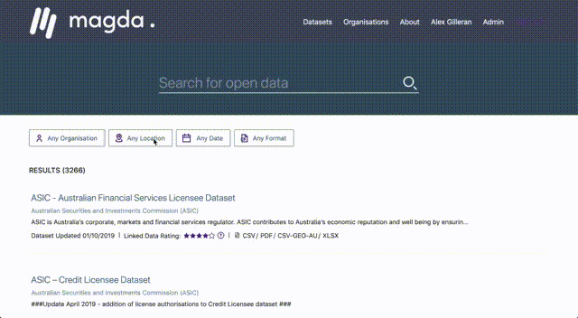
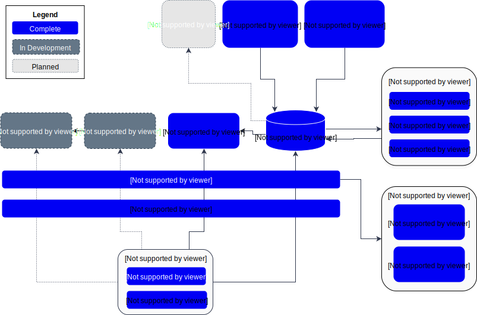

# Magda

[](https://github.com/magda-io/magda/releases)
[](https://gitlab.com/magda-data/magda/commits/master)
[](https://demo.dev.magda.io)
[](https://github.com/magda-io/magda/discussions)

Magda is a data catalog system that will provide a single place where all of an organization's data can be catalogued, enriched, searched, tracked and prioritized - whether big or small, internally or externally sourced, available as files, databases or APIs. Magda is designed specifically around the concept of _federation_ - providing a single view across all data of interest to a user, regardless of where the data is stored or where it was sourced from. The system is able to quickly crawl external data sources, track changes, make automatic enhancements and make notifications when changes occur, giving data users a one-stop shop to discover all the data that's available to them.



## Current Status

Magda is under active development by a small team - we often have to prioritise between making the open-source side of the project more robust and adding features to our own deployments, which can mean newer features aren't documented well, or require specific configuration to work. If you run into problems using Magda, we're always happy to help on [GitHub Discussions](https://github.com/magda-io/magda/discussions).

### As an open data search engine

Magda has been used in production for over a year by [data.gov.au](https://data.gov.au), and is relatively mature for use in this use case.

### As a data catalogue

Over the past 18 months, our focus has been to develop Magda into a more general-purpose data catalogue for use within organisations. If you want to use it as a data catalog, please do, but expect some rough edges! If you'd like to contribute to the project with issues or PRs, we love to recieve them.

## Features

- Powerful and scalable search based on [OpenSearch](https://opensearch.org/)
- Quick and reliable aggregation of external sources of datasets
- An unopinionated central store of metadata, able to cater for most metadata schemas
- Federated authentication via passport.js - log in via Google, Facebook, WSFed, AAF, CKAN, and easily create new providers.
- Based on Kubernetes for cloud agnosticism - deployable to nearly any cloud, on-premises, or on a local machine.
- Easy (as long as you know Kubernetes) installation and upgrades
- Extensions are based on adding new docker images to the cluster, and hence can be developed in any language

### Currently Under Development

- A heavily automated, quick and easy to use data cataloguing process intended to produce high-quality metadata for discovery
- A robust, policy-based authorization system built on Open Policy Agent - write flexible policies to restrict access to datasets and have them work across the system, including by restricting search results to what you're allowed to see.
- Storage of datasets

Our current roadmap is available at https://magda.io/docs/roadmap

## Architecture

Magda is built around a collection of microservices that are distributed as docker containers. This was done to provide easy extensibility - Magda can be customised by simply adding new services using any technology as docker images, and integrating them with the rest of the system via stable HTTP APIs. Using Helm and Kubernetes for orchestration means that configuration of a customised Magda instance can be stored and tracked as plain text, and instances with identical configuration can be quickly and easily reproduced.



If you are interested in the architecture details of Magda, you might want to have a look at [this doc](./docs/docs/architecture/Guide%20to%20Magda%20Internals.md).

### Registry

Magda revolves around the _Registry_ - an unopinionated datastore built on top of Postgres. The Registry stores _records_ as a set of JSON documents called _aspects_. For instance, a dataset is represented as a record with a number of aspects - a basic one that records the name, description and so on as well as more esoteric ones that might not be present for every dataset, like temporal coverage or determined data quality. Likewise, distributions (the actual data files, or URLs linking to them) are also modelled as records, with their own sets of aspects covering both basic metadata once again, as well as more specific aspects like whether the URL to the file worked when last tested.

Most importantly, aspects are able to be declared dynamically by other services by simply making a call with a name, description and JSON schema. This means that if you have a requirement to store extra information about a dataset or distribution you can easily do so by declaring your own aspect. Because the system isn't opinionated about what a record is beyond a set of aspects, you can also use this to add new entities to the system that link together - for instance, we've used this to store projects with a name and description that link to a number of datasets.

### Connectors

Connectors go out to external datasources and copy their metadata into the Registry, so that they can be searched and have other aspects attached to them. A connector is simply a docker-based microservice that is invoked as a [job](https://kubernetes.io/docs/concepts/workloads/controllers/jobs-run-to-completion/). It scans the target datasource (usually an open-data portal), then completes and shuts down. We have connectors for a number of existing open data formats, otherwise you can easily write and run your own.

### Minions

A minion is a service that listens for new records or changes to existing records, performs some kind of operation and then writes the result back to the registry. For instance, we have a broken link minion that listens for changes to distributions, retrieves the URLs described, records whether they were able to be accessed successfully and then writes that back to the registry in its own aspect.

Other aspects exist that are written to by many minions - for instance, we have a "quality" aspect that contains a number of different quality ratings from different sources, which are averaged out and used by search.

### Search

Datasets and distributions in the registry are ingested into an [OpenSearch](https://opensearch.org/) cluster, which indexes a few core aspects of each and exposes an API.

> Please note: since v4.0.0, we replaced the internal [ElasticSearch](https://www.elastic.co/elasticsearch) cluster with latest [OpenSearch](https://opensearch.org/) cluster. As OpenSearch is a fork of open source Elasticsearch 7.10. As such, it provides backwards REST APIs for ingest, search, and management. The query syntax and responses are also the same.

### User Interface

Magda provides a user interface, which is served from its own microservice and consumes the APIs. We're planning to make the UI itself extensible with plugins at some point in the future.

## To try the last version (with prebuilt images)

If you just want to install a local testing version, installing Magda using [Helm](https://helm.sh/) is relatively easier (you can use [minikube](https://minikube.sigs.k8s.io/docs/) to install a local k8s test cluster):

```bash
# create a namespace "magda" in your cluster
kubectl create namespace magda

# install Magda version v5.0.1 to namespace "magda", turn off openfass function and expose the service via loadBalancer
helm upgrade --namespace magda --install --version 5.0.1 --timeout 9999s --set magda-core.gateway.service.type=LoadBalancer magda oci://ghcr.io/magda-io/charts/magda
```

> Since v2, we release our helm charts to Github container registry: `oci://ghcr.io/magda-io/charts`

You can find out the load balancer IP and access it:

```bash
echo $(kubectl get svc --namespace magda gateway --template "{{ range (index .status.loadBalancer.ingress 0) }}{{ . }}{{ end }}")
```

If you are interested in playing more, you might find useful docs from [here](./docs/docs/). Particularly:

- [Magda Charts Docs Index](./docs/docs/helm-charts-docs-index.md)
- [How to create a local testing user](./docs/docs/how-to-create-local-users.md)
- [How to set a user as admin user](./docs/docs/how-to-set-user-as-admin-user.md)

You might also want to have a look at this tutorial repo:

https://github.com/magda-io/magda-brown-bag

Or find out more on: https://magda.io/docs/building-and-running if you are interested in the development or play with the code.

## To build and run from source

https://magda.io/docs/building-and-running

## To get help with developing or running Magda

Start a discussion at https://github.com/magda-io/magda/discussions. There's not a lot on there yet, but we monitor it closely :).

## Want to get help deploying it into your organisation?

Email us at contact@magda.io.

## Want to contribute?

Great! Take a look at https://github.com/magda-io/magda/blob/master/.github/CONTRIBUTING.md :).

## Documentation links

- [Magda API Reference](https://demo.dev.magda.io/api/v0/apidocs/index.html)
- [Magda Helm Chart Reference](docs/docs/helm-charts-docs-index.md)
- [Migration & Upgrade Documents](docs/docs/migration)
- [Other documentations](docs/docs/index.md)

More documents can be found from the folder [docs/docs/](./docs/docs/).
