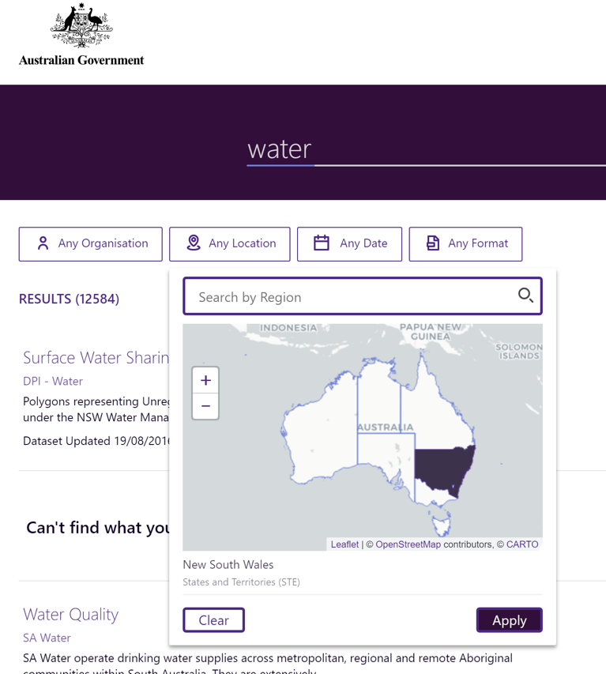
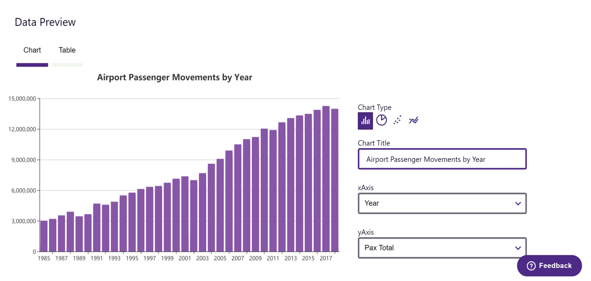
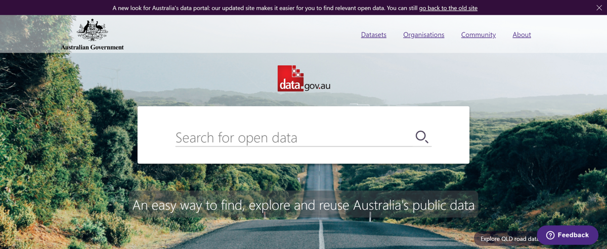

    <iframe width="560" height="315" src="https://www.youtube-nocookie.com/embed/3089ulXeH4M?rel=0&amp;showinfo=0" frameborder="0" allow="autoplay; encrypted-media" allowfullscreen></iframe>

# Get the most out of your data

Government agencies possess a wealth of valuable data, but it often sits hidden inside spreadsheets and on shared drives, making it impossible to discover or navigate through. Data that could improve efficiency, transparency and accountability is trapped in silos, and the opportunity that it offers is lost.

Even if data is already opened and published to an open data portal, it’s still difficult to discover. Because current open data portals have been focused around hosting files they possess simplistic search functionality, poor metadata authoring tools and no ability to easily preview datasets before downloading, making even the best datasets difficult to find and use.

## A set of tools for every part of the data landscape

Magda is an open-source software platform that has been designed to make publishing, searching and using government data easier, for both government agency staff using private data internally and citizens using open data publically. It consists of a set of tools that can be combined into a number of configurations:

-   An internal portal for hosting data within agencies, which will eventually have robust mechanisms for controlling which users can see or use which data
-   An internal/external portal that both hosts internal data as above, but also provides workflows for safely sharing datasets between agencies or releasing some datasets as open data, and making those available to the public
-   A public aggregator that takes datasets from many sources and makes it all easily searchable in one place

... or any combination thereof. Its capabilities include:

#### Powerful search

The easiest way to find a dataset is by searching for it, and Magda puts its search functionality front and centre. Magda is able to rate datasets by their quality and return the best ones at the top of the search, understand synonyms and acronyms, as well as provide a number of advanced filters including the ability to search for datasets that affect a certain spatial region or a time period.

    

#### Easy federation

Seamlessly combine self-hosted datasets with those from external sources into one, easily-searchable repository.

#### Rich previews

Ensure that your users can quickly determine if a dataset is useful for them with charting, spatial preview with [TerriaJS](https://terria.io) and table previews.

    

#### Automatic metadata enhancement

The metadata that describes datasets is often poorly formatted or completely absent, making them difficult to search for and understand. Magda is able to enhance the metadata of both locally hosted and external datasets in by checking for broken links, normalising formats, calculating quality and determining the best means of visualisation.

#### Open architecture

Magda is designed as a set of microservices that allow extension by simply adding more services into the mix. Extensions to collect data from different data sources or enhance metadata in new ways can be written in any language and added or removed from a running deployment with zero downtime and no effect on upgrades of the core product.

    

#### Easy set up and upgrades

Magda uses Kubernetes and Helm to allow for simple installation and zero-downtime upgrades with a single command.

## Want to run Magda inside your agency?

We'd love to talk to you! Please get in contact with us at [contact@magda.io](mailto:contact@magda.io).

## See it in action

Magda currently powers the new data.gov.au beta at [search.data.gov.au](https://search.data.gov.au), serving 2000 users per week.

    

## Current status

Magda is currently in development, and we're currently working on adding more features to make Magda useful as an internal data portal like publishing, dataset hosting and access control. You can see our roadmap and current progress [here](/docs/roadmap).

## Want to get it running yourself?

[Try the latest version](https://github.com/magda-io/magda-config), or [build and run from source](https://magda.io/docs/building-and-running)

## Latest Release

<a href="{{ site.github.url}}">{{ site.github.latest_release.tag_name }}</a>, released at {{ site.github.latest_release.published_at}}

## Open Source

Magda is fully open source, licensed under the Apache License 2.0. Thanks to all our open source contributors so far:



We welcome new contributors too! please check out our [Contributor's Guide](https://github.com/magda-io/magda/blob/master/.github/CONTRIBUTING.md).

## Important links

-   [Our Github](https://github.com/magda-io/magda)
-   [Our documentation](/docs)
-   [Magda API](https://search.data.gov.au/api/v0/apidocs/index.html)

The project was started by CSIRO [Data61](https://data61.csiro.au/) and Australia's [Department of Prime Minister and Cabinet](https://www.pmc.gov.au/). It's progressing thanks to Data61 and the [Digital Transformation Agency](https://www.dta.gov.au/)
