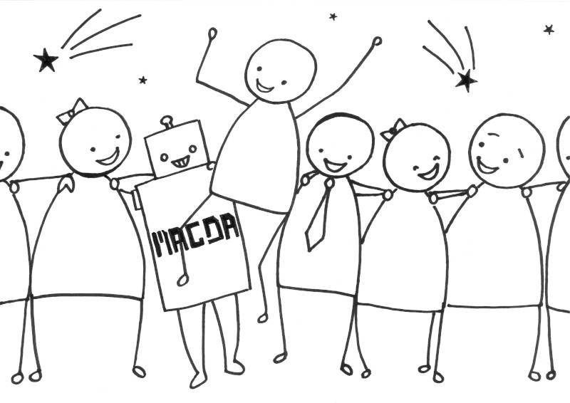
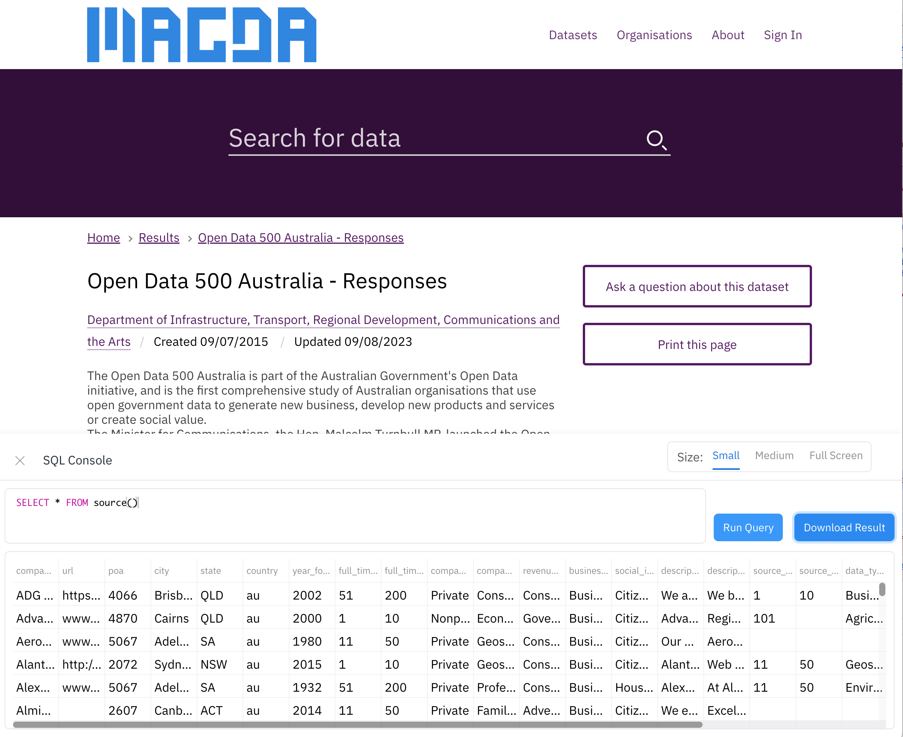
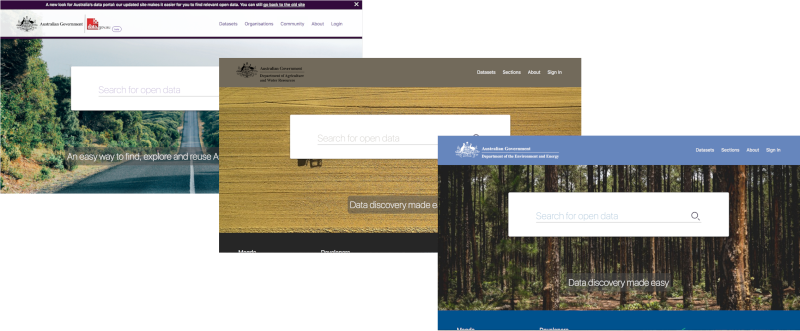

<p class="center">
    <iframe width="560" height="315" src="https://www.youtube.com/embed/Jqlu34eocVA" frameborder="0" allow="accelerometer; autoplay; encrypted-media; gyroscope; picture-in-picture" allowfullscreen></iframe>
</p>

# A Federated, AI-Enhanced Data Catalog for All Your Data

**Discover. Understand. Govern.**  
From Excel to APIs, from legacy systems to LLM-powered interfaces.

The better an organization understands and uses its data, the better it is able to make decisions and discover new opportunities. Many organizations hold massive quantities of data, but it often gets stuck inside organizational silos where its importance is invisible, origins untracked, and existence unknown to those elsewhere in the organization who could improve or derive further value from it.

Magda is a data catalog system that provides a single place where all of your organization's data can be catalogued, enriched, searched, tracked and prioritized - whether big or small, internally or externally sourced, available as files, databases or APIs. With Magda, your data analysts, scientists and engineers can easily find useful data with powerful discovery features, properly understand what they're using thanks to metadata enhancement and authoring tools, and make data-informed decisions with confidence as a result of history tracking and duplication detection.

### Let your data mingle!

Magda is designed around the concept of _federation_ - providing a single view across all data of interest to a user, regardless of where the data is stored or where it was sourced from. Where other data catalogs are designed around their creators' other data products or implement federation by simply copying external datasets internally, federating over many data sources of any format is at the core of how Magda works. The system is able to quickly crawl external data sources, track changes, make automatic enhancements and push notifications when changes occur, giving your data users a one-stop shop to discover all the data that's available to them.

<p class="center">
    
</p>

### Don't neglect your small data

Investment in data often focuses on extracting value from _big data_ - big, complex datasets that are already known to be of high value. This focus comes at the expense of _small data_ - the myriad Excel, CSV and even PDF files that are critical to the operations of every organization, but unknown outside the teams and individuals that use them.

This results in squandered opportunities as small datasets go undiscovered by other teams who could make use of or combine them, fragmentation as files are shared and modified via untracked, ad-hoc methods, and waste as datasets are collected or acquired multiple times, often at extreme expense.

<p class="center">
    
</p>

Magda is designed with the flexibility to work with _all_ of an organisation's data assets, big or small - it can be used as a catalog for big data in a data lake, an easily-searchable repository for an organization's small data files, an aggregator for multiple external data sources, or all at once.

## ✨ What’s New in Magda v5.0.0

### 🧠 In-Browser LLM Chatbot

<p class="center">
    <iframe width="560" height="315" src="https://www.youtube.com/embed/AvB2YiFU59g" frameborder="0" allow="accelerometer; autoplay; encrypted-media; gyroscope; picture-in-picture" allowfullscreen></iframe>
</p>

Explore your data with natural language:

- Ask questions like "Which region had the highest rainfall in 2023?"
- Perform tabular analysis and get charts & summaries
- All processed **privately in-browser** via WebGPU

### 🔍 Hybrid Search Engine

Combine keyword precision and semantic understanding:

- Vector + lexical search with BM25 ranking
- Handles synonyms, fuzzy phrasing, and structured filters
- Ideal for technical and natural language queries alike

### 📊 SQL Console in Your Browser

<p class="center">
    
</p>

Query data without backend setup:

- Supports Excel, CSV, and more
- Powered by in-browser SQL execution
- One-click export to CSV

## Features

### Discovery

The easiest way to find a dataset is by searching for it, and Magda puts its search functionality front and centre. Magda was originally developed for the Australian Government's open data portal data.gov.au, where it supported discovery and access to over 100,000 datasets during its deployment between 2019 and 2025. Although this contract concluded in June 2025, Magda remains an open-source platform powering new innovations across public and private sectors worldwide.

When users search they expect the result to be the best result for the meaning of their query, not simply the one with the most keyword matches. Magda is able to return higher-quality datasets above lower-quality ones, understand synonyms and acronyms, as well as search by time or geospatial extent.

<p class="center">
    <video autoplay="false" loop="true" controls>
        <source src="/assets/searchdemo420p.webm" type="video/webm" >
    </video>
</p>

### Federation

Magda is designed from the ground-up with the ability to pull data from many different sources into one easily searchable catalog in which all datasets are first-class citizens, regardless of where they came from. Magda can accept metadata from our easy-to-use cataloging process, existing Excel or CSV-based data inventories, existing metadata APIs such as CKAN or Data.json, or have data pushed to it from your systems via its REST API.

In Magda, all data is first-class regardless of its source. Data in Magda is combined into one search index with history tracking and even webhook notifications when metadata records are changed.

### Previews

Easily determine if a dataset is useful with charting, spatial preview with [TerriaJS](https://terria.io) and automatic charting of tabular data.

<p class="center">
    
</p>

### Metadata enhancement

Authoring of high-quality metadata has historically been difficult and time-consuming. As a result, metadata around datasets is often poorly formatted or completely absent making them difficult to search for and hard to understand once found.

Magda is able to automatically derive and enhance metadata, without the underlying data itself ever being transmitted to a Magda server. For datasets catalogued directly, our "Add Dataset" process is able to read and derive data from files directly in the browser, without the data itself ever having to leave the user's machine, and for both internal and external datasets our minion framework is able check for broken links, normalize formats, calculate quality, determine the best means of visualisation and more. This framework for enhancement is open and extensible, allowing to build your own enhancement processes using any language that can be deployed as a docker container.

<p class="center">
    <video autoplay="false" loop="true" controls>
        <source src="/assets/metadatacomplete420p.webm" type="video/webm" >
    </video>
</p>

### Open architecture

Magda is designed as a set of microservices that allow extension by simply adding more services into the mix. Extensions to collect data from different data sources or enhance metadata in new ways can be written in any language and added or removed from a running deployment with little downtime and no effect on upgrades of the core product.

<p class="center">
    
</p>

### Easy set up and upgrades

Magda uses Kubernetes and Helm to allow for simple installation and minimal downtime upgrades with a single step. Deploy it to the cloud, your on-premises setup or even your local machine with the same set of commands.

### Federated authentication

Based on [PassportJS](http://www.passportjs.org/), Magda's authentication system is able to integrate with a wide and growing range of different providers. Currently supported are:

- Google
- Facebook
- CKAN
- AAF
- VANguard (WSFed)
- ESRI Portal
- [Okta](https://www.okta.com)

<p class="center">
    <video autoplay="false" loop="true" controls>
        <source src="/assets/logincomplete420p.webm" type="video/webm" >
    </video>
</p>

You can also develop your own authentication plugins to customise the authentication or user onboarding process. More information can be found from the [authentication-plugin-spec](https://github.com/magda-io/magda/blob/master/docs/docs/authentication-plugin-spec.md) document.

### A better way to manually catalog datasets

Authoring a quality dataset is hard - not only does it involve a lot of manual work, but it also requires a great deal of up-front knowledge and data literacy. We're building a guided, opinionated and heavily automated publishing process into Magda that will result in an easier time for those who publish data, and higher metadata quality to make it easier to search and use datasets for data users downstream.

<p class="center">
    <video autoplay="false" loop="true" controls>
        <source src="/assets/mapdemo420p.webm" type="video/webm" >
    </video>
</p>

### Reducing duplication

Often the use of ad-hoc sharing mechanisms such as email or USB disks results in multiple copies of a dataset being modified in parallel, and poor historical visibility of an organization's data holdings leads to external data being bought multiple times by different teams. We're adding features to automatically identify and mitigate duplication, without the need for the data to actually be stored on Magda itself.

### Authorization: Share data with confidence

We're adding an integrated, customizable authorization system into Magda based on [Open Policy Agent](https://www.openpolicyagent.org/), which will allow:

- Datasets to be restricted based on established access-control frameworks (e.g. role-based), or custom policies specified by your organization
- Federated authorization - Magda will be able not only to pull data from an external source, but also mimic the same authorization policies, so that what you see from that system on Magda is exactly the same as if you logged into it directly
- Seamless integration with search - only get back results that you have access to

## Work with us

We're always looking to help more organizations use their data better with Magda!

If you'd like to become a co-creation partner, want our help getting up and running, or want to sponsor specific features, we'd love to talk to you! Please get in contact with us at [contact@magda.io](mailto:contact@magda.io). You can also ask questions in [Our Github Discussions forum](https://github.com/magda-io/magda/discussions).

> Interested in expert support or co-developing features? Learn more about [how we support the community and our clients](https://magda.io/docs/how-we-support-the-community-and-our-clients.html).

Magda is also completely open-source and can be used for free - to get it running, please see the instructions [below](#want-to-get-it-running-yourself). Don't forget to let us know you're using it!

## Who’s Used Magda

Magda has powered national- and state-level data portals, research infrastructure, and public sector data ecosystems. Some of the organizations who have previously deployed Magda include:

- [Digital Transformation Agency](https://www.dta.gov.au/) and later the [Australian Bureau of Statistics](https://www.abs.gov.au/) – Deployed & Managed Magda platform for [data.gov.au](https://data.gov.au) from 2019 to June 2025
- [CSIRO Land and Water](https://www.csiro.au/en/Research/LWF) – Knowledge Network V2
- [Department of Agriculture](http://www.agriculture.gov.au/) – Private instance
- [Department of the Environment and Energy](https://www.environment.gov.au/) – Private instance
- [NSW Department of Customer Service](https://www.customerservice.nsw.gov.au/) – NSW Spatial Digital Twin
- [QLD Department of Natural Resources, Mines and Energy](https://www.dnrme.qld.gov.au/) – QLD Spatial Digital Twin

Magda is used in a variety of contexts — from open data portals serving national audiences, to private, domain-specific platforms supporting research workflows and scientific discovery. Its flexibility makes it a good fit for governments, research agencies, and enterprises that need to integrate diverse datasets across complex technical landscapes.

<p class="center">
    
</p>

Alongside our open-source work, we’ve been developing Magda++, a proprietary platform built on top of the Magda open-source core, tailored for scientific research applications. While Magda provides a general-purpose federated data catalog, Magda++ extends this with specialized AI/ML capabilities designed to support interactive scientific discovery and decision-making. Unlike Magda’s lightweight, in-browser AI, Magda++ integrates more powerful models, enabling deeper analysis and domain-specific insights across scientific fields.

Magda++ is designed to bridge AI and scientific research, enabling researchers to integrate, analyse, and apply complex data more effectively. A key focus is Food Value Chain Optimization with AI Insights, where AI helps uncover hidden patterns in agricultural data, from genomic traits to environmental impacts, to improve crop yields and sustainability. Magda++ also facilitates interactive knowledge discovery, allowing researchers to navigate scientific challenges through AI-assisted reasoning and data fusion. Magda++ is redefining how AI powers scientific discovery, combining advanced AI models, interactive data exploration, and domain expertise to tackle real-world research challenges.

> _These deployments shaped Magda’s evolution and validated its capabilities in real-world, mission-critical environments._

## Want to get it running yourself?

If you just want to install a local testing version, installing Magda using [Helm](https://helm.sh/) is relatively easier (you can use [minikube](https://minikube.sigs.k8s.io/docs/) to install a local k8s test cluster):

```bash
# create a namespace "magda" in your cluster
kubectl create namespace magda

# install Magda version v5.0.1 to namespace "magda", turn off openfass function and expose the service via loadBalancer
helm upgrade --namespace magda --install --version 5.0.1 --timeout 9999s --set magda-core.gateway.service.type=LoadBalancer magda oci://ghcr.io/magda-io/charts/magda
```

> Since v2, we release our helm charts to Github container registry: `oci://ghcr.io/magda-io/charts`

You can find out the load balancer IP and access it:

```bash
echo $(kubectl get svc --namespace magda gateway --template "{{ range (index .status.loadBalancer.ingress 0) }}{{ . }}{{ end }}")
```

If you are interested in playing more, you might find useful docs from [here](./docs/). Particularly:

- [Magda Charts Docs Index](./docs/helm-charts-docs-index.html)
- [How to create a local testing user](./docs/how-to-create-local-users.html)
- [How to set a user as admin user](./docs/how-to-set-user-as-admin-user.html)

You might also want to have a look at this tutorial repo:

https://github.com/magda-io/magda-brown-bag

Or find out more on: https://magda.io/docs/building-and-running if you are interested in the development or play with the code.

## Want to build your connectors / minions?

You can extend Madga's functionality by [building your own customised connectors / minions](https://magda.io/docs/how-to-build-your-own-connectors-minions).

## Want to build your authentication plugins?

You can add support to different authorization servers / identity providers or customise the user on-boarding process by [building your own customised authentication plugins](https://magda.io/docs/authentication-plugin-spec).

## Latest Release

<a href="{{ site.github.url}}">{{ site.github.latest_release.tag_name }}</a>, released at {{ site.github.latest_release.published_at}}

## Open Source

Magda is fully open source, licensed under the Apache License 2.0. Thanks to all our open source contributors so far:

<a target="_blank" rel="nofollower noreferrer" href="{{contributor.html_url}}" alt="{{contributor.login}}" title="{{contributor.login}}">

</a>

We welcome new contributors too! please check out our [Contributor's Guide](https://github.com/magda-io/magda/blob/master/.github/CONTRIBUTING.md).

## Important links

- [Our Github](https://github.com/magda-io/magda)
- [Magda API Reference](https://magda-io.github.io/api-docs/index.html)
- [Magda Helm Chart Reference](/docs/helm-charts-docs-index)
- [Useful common documentations](./docs/index.md)
- [Other documentations](https://github.com/magda-io/magda/tree/master/docs/docs)
- [How We Support the Community and Our Clients](https://magda.io/docs/how-we-support-the-community-and-our-clients.html)
- [Ask Questions on Our Github Discussions forum](https://github.com/magda-io/magda/discussions)

The project was started by CSIRO's [Data61](https://data61.csiro.au/) and Australia's [Department of Prime Minister and Cabinet](https://www.pmc.gov.au/). It's progressing thanks to Data61, the [Digital Transformation Agency](https://www.dta.gov.au/), the [Department of Agriculture](http://www.agriculture.gov.au/), the [Department of the Environment and Energy](https://www.environment.gov.au/) and [CSIRO Land and Water](https://www.csiro.au/en/Research/LWF).
