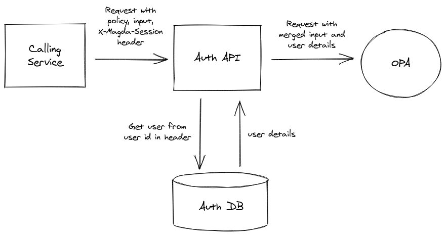
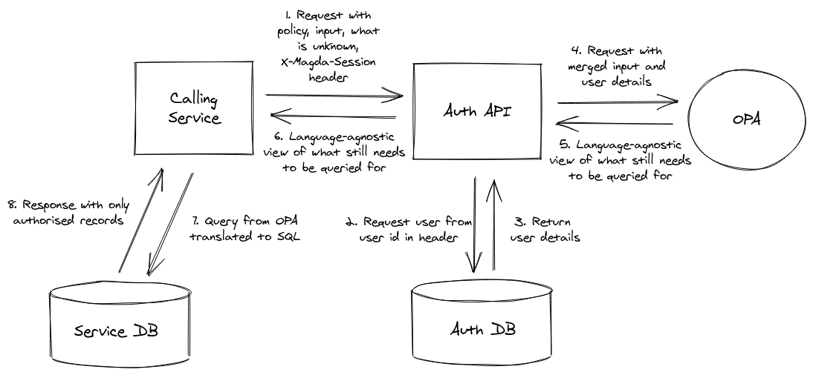
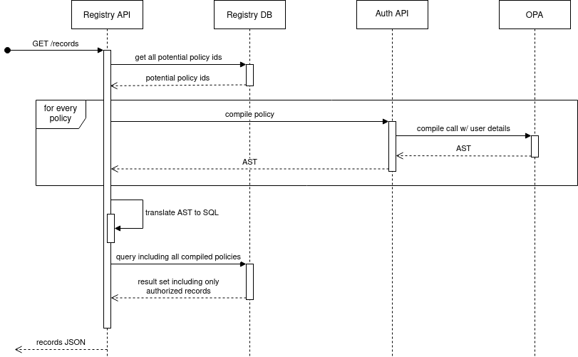

Guide to Magda Internals

# Guide to Magda Internals

[[toc]]

# Architecture Diagram


# Components

As a microservices-based system, Magda consists of a number of individual parts. What follows is a description of the responsibility and capabilities of each, in rough alphabetical order.

## Authorization API

The Authorization API has a few responsibilities that also touch on authentication as well (possibly this deserves a refactoring!). It is responsible for:

-   Storing what we know about users
-   Determining what a user is allowed to do
-   Storing the details of Magda's non-federated authentication - e.g. internal Magda passwords and API keys

To make this happen, the Auth API has both its own database and a connection to [Open Policy Agent (OPA)](https://www.openpolicyagent.org/). It wraps an API around OPA that allows it to be called with just a JWT identifying the current user, and automatically passes in the user's details in the format expected by the OPA policies. See [Authorization](#authorization-authz) for more details about how Magda's authn system works.

## Connectors

Connectors are responsible for bringing in data from other sources on a one-time or regular basis. Connectors go out to external datasources and copy their metadata into the Registry, so that they can be searched and have other aspects attached to them. A connector is simply a docker image that is invoked as a job. It scans the target datasource (usually an open-data portal), then completes and shuts down. We have connectors for a number of existing open data formats, otherwise you can easily write and run your own.

## Content API

The Content API is responsible for everything to do with _content_ - that is, what a user sees and interacts with (as opposed to an admin, or another service within the system). Ideally this would mean that all text seen by a user was managed by the Content API, but in practice only a small amount is, the rest is (sadly) baked into the UI at this point.

The Content API is like a very very light headless CMS, used by Magda to hold text and files around content - e.g. the text for certain pages, and certain configurable images like logos. Content can be retrieved by ID, or by querying - e.g. the Magda UI makes a query for anything that affects the header or the footer when it does its initial render, and uses the result to determine what should be in those components.

The Content API was created a long time before the Storage API, and hence stores files in its database by base64ing them and putting them in a table - there's possibly an opportunity to use the Storage API for this instead.

## Correspondence API

The Correspondence API is responsible for sending messages to people (_not_ sending them to machines). In practice this currently just means sending emails based on requests from the UI, but in the future it could potentially also take into account other messaging mediums like SMS or push notifications, and other classes of message like notifications about something changing in the system.

Currently the Correspondence API is used to send questions about datasets to the contact point listed against the contact point if possible, and send direct questions to the Magda admin email address. In order to route a question to the dataset contact point, it grabs the contact point information from the `dcat-dataset-strings` aspect in the registry and if it can find something that looks like an email address in there, it'll use that as the recipient - otherwise it falls back to the default Magda email address.

Email templates are stored in the Content API. The Correspondence API gets the information it needs, passes that information into a template, then uses a configured SMTP server to send out emails. Usually we end up using Mailgun, but it should be possible to route through any SMTP server. Note that the standard SMTP port is usually blocked by cloud providers, however.

## Gateway

The Gateway is responsible for:

-   Proxying requests from outside Magda to the correct service
-   Authenticating users when they sign in
-   Authenticating (not authorising) requests, according to the supplied auth cookie or API key
-   Maintaining sessions

See [Authentication](#authentication-authn) for more details around how it handles authn.

## Minions

A minion is a service that listens for new records or changes to existing records, performs some kind of operation and then writes the result back to the registry. For instance, we have a broken link minion that listens for changes to distributions, retrieves the URLs described, records whether they were able to be accessed successfully and then writes that back to the registry in its own aspect. Minions don't currently really have a responsibility within the system - their responsibility depends on what they're designed to do, which varies.

Other aspects exist that are written to by many minions - for instance, we have a "quality" aspect that contains a number of different quality ratings from different sources, which are averaged out and used by search.

## Registry

The Registry is responsible for:

-   Storing and being the source of truth for the metadata managed by Magda
-   Letting other services know about changes to this metadata

### Records

Everything in the registry, regardless of what it is, is represented as a “record” in the registry - think of it as a similar concept to a row in a database table, or an object in Object-Oriented Programming. Datasets are records, distributions are records, organisations are records, etc.

### Aspects

A record by itself has only an id and a name attached to it. All other metadata sits within “aspects”, instances of which are attached to records.

An aspect is like a class in OOP - it defines how a certain part of a record should look. A record will have instances of a number of aspects - e.g. a dataset might have an aspect to describe its basic metadata (`dcat-dataset-strings`), another one to describe its currency (`currency`), and another one to keep track of its sync status with an external ckan repository (`ckan-export`).

This means that what a record represents isn’t static - it can be changed and added to over time by adding or removing aspects. For example, a record representing a dataset harvested from an external portal might start with a dcat-dataset-strings aspect, but you might want to define your own aspect definition, and then add your own complementary metadata to it.

An aspect consists of an id, a name and a JSON schema, which is used to validate new data as its added. Aspects are able to be declared dynamically by other services by simply making a `PUT` or `POST` call with these details. This means that if you have a requirement to store extra information about a dataset or distribution you can easily do so by declaring your own aspect. Because the system isn't opinionated about what a record is beyond it being a set of aspects, you can also use this to add new entities to the system that link together - for instance, we've used this to store projects with a name and description that link to a number of datasets.

### Record-Aspects

A record is stored as a set of aspects attached to that record. For instance, a dataset might have a a basic one that records the name, description and so on as well as more esoteric ones that might not be present for every dataset, like temporal coverage or determined data quality. Likewise, distributions (the actual data files, or URLs linking to them) are also modelled as records, with their own sets of aspects covering both basic metadata once again, as well as more specific aspects like whether the URL to the file worked when last tested. These are recorded in the Registry database as "recordaspects" - an instance of an aspect that's attached to a record.

### Events

An event is generated any time something changes in the Registry - generally when a record, aspect or record-aspect is:

-   Created
-   Deleted
-   Modified

Events that record a modification generally record a JSON patch that details what changed inside that entity. Events can be used to track the history of an entity over time, or to reconstruct that entity at a certain time and see what it used to be.

### Webhooks

Webhooks allow services outside the registry (and potentially outside the Magda instance itself, one day) to be notified of events occurring within the registry, as they occur. A webhook is registered by `POST`ing to the webhooks endpoint and specifying what event type(s) are to be listened for, what aspects are to be listened for, and a URL to call with the event payload. After the webhook is created, the registry will call that URL whenever an event matching the recorded query changes.

For instance, the search indexer keeps the ElasticSearch index up to date by subscribing to nearly every event type that has to do with the `dcat-dataset-strings`, `dataset-distributions` and a few other aspects. When any dataset record is added, deleted or modified in the registry, a webhook is sent to the indexer with details of the change and an up-to-date version of the record, which the indexer either ingests or deletes depending on the event type.

## Search API

The responsibility of the Search API is to provide as powerful of a search function as possible, primarily for datasets and a few other objects (publishers, regions).

It's implemented as a wrapper around ElasticSearch, and allows for searching of datasets, publishers and regions. Note that unlike the Registry, the Search API does not have the same open, schema-less, unopinionated design regarding what it stores and how it stores it - the Search API is specifically designed to search for certain objects like datasets, and has a separate endpoint for each object type.

## Search Indexer

The responsibility of the Search Indexer is to:

-   Set up the ElasticSearch index definitions
-   Put relevant information (datasets, publishers etc) into the ElasticSearch index, so that the [Search API](#search-api) can get it out later.
-   Make other changes to the ElasticSearch index that enable search - e.g. putting regions in so that they can be used for spatial search, loading in the Wordnet synonyms dataset etc.

The Search Indexer is always trying to make sure that the datasets stored in the search index matches what's in the Registry's database - this means both responding to Webhook events and doing an initial load of all the datasets in the registry both the first time Magda is run, and whenever the index definition is changed.

On first startup, the Indexer will also try to set up the regions index - at the moment this only knows how to pull in GeoJSON files of ABS regions from the Terria AWS account's S3 and (slowly) load them in. Currently if this is interrupted it won't be retried unless the entire regions index is deleted :(.

The index definitions used by the Indexer change over time - within the code itself there are index definitions, and these have an integer describing their version. When the indexer starts up, it'll check for the existence of an index with its current version - if it can't find one, it'll create it and start populating it. Because the version used by the Search API is specified elsewhere, this means that you can have the indexer working on setting up `datasets41`, for instance, while the Search API is still querying against version `datasets40`.

## Storage API

The Storage API is responsible for storing and retrieving files, and applying authorization to those operations.

It acts as a wrapper around [MinIO](https://min.io/), which in turn allows it to be backed by a stateful set or other storage solutions like S3 or Google Storage.

Currently it has a rudimentary authorization mechanism that allows files to be linked to the id of a record in the Registry - only if the requesting user is allowed to see that record are they allowed to download the file. This allows file downloads to be protected in a way that matches record authorization in the Registry.

## Web Server

The web server responsible for serving the files (HTML/JS/CSS) needed to render the front-end, and for passing configuration to the web application. Note that the server logic is specified in the `magda-web-server` directory, but the client-side logic is in `magda-web-client`, which is incorporated into the web server docker image at build time.

# Authentication (authn)

## Internal Requests

For requests between pods within Magda, HTTP requests are authenticated by passing a JWT in the `X-Magda-Session` header, which contains at least `userId` as a claim (but could potentially contain more information). The `userId` claim must be the id of a user that can be looked up using the Auth API, and must be signed using a shared JWT secret that's passed to pods via Kubernetes.

Making a request within Magda with no `X-Magda-Session` is also valid - these are treated as being unauthenticated - i.e. they don't come from a particular user. E.g. this is the case for most requests through data.gov.au, where nearly no one signs in.

## External Requests

For requests that come from outside Magda, authentication is applied at the Gateway, with the help of the [NodeJS Passport library](http://www.passportjs.org/).

Currently an external request can be authenticated in two ways:

### Session Cookie

Magda uses [express-session](https://www.npmjs.com/package/express-session) to manage session-based authentication. When a user signs in (via an endpoint in the gateway, that's called from the front-end), it attaches a cookie to the response that contains a session id, and a session is recorded in the Session DB against it that contains the user id. When subsequent requests come in with that cookie, the gateway will look up the session id, and if it's both valid and unexpired it will get the user id and forward the request to the appropriate internal API with an `X-Magda-Session` header attached (see _Internal Requests_ above) containing that user id.

In this way, only the gateway needs to know that external requests even exist - all other services in Magda can treat internal and external requests identically.


### API Key

Recently Magda has added the ability to authenticate via an API Key rather than logging in - this makes it much easier to authenticate requests when trying to use the Magda API from code rather than from a browser.

API Keys are created up-front - one user can have zero-to-many API Keys associated with it. An API Key consists of an ID, and the key itself. Currently they're created via the `yarn create-api-key` script, until some kind of control panel functionality to create them is built.

If the request provides `X-Magda-API-Key` and `X-Magda-API-Key-Id` headers, these will be looked up in the Auth API, and if valid, then the request will be forwarded with an `X-Magda-Session` JWT with the user id associated with that API Key.


# Authorization (authz)

## Legacy System

The authorization system within Magda is very much a work in progress. For most of the project's history, the authz system has boiled down to a boolean: either a user is an admin, or is not an admin, as specified by a value in the users table of the Auth DB. If the user is an admin they can do essentially anything in the system, if the user is _not_ an admin they don't have the ability to make any changes at all. Magda has been able to get away with having such a simple mechanism in place for quite a while, because for its original data.gov.au use-case nearly every user had the access to view anything, but nearly all changes were done automatically without user intervention.

## Future System

Going forward, we want to move to a policy-based authorization system via [Open Policy Agent (OPA)](https://www.openpolicyagent.org/). At the time of writing, this is partially implemented - mostly inside the Registry API.

OPA allows for a _policy_ to be specified to determine whether a specific action should be allowed or denied. These policies are written in OPA's prolog-esque domain-specific-language _Rego_, and can be changed at runtime if necessary.

Evaluating these policies can be accomplished in a number of ways, but the way we do it in Magda is by operating OPA as a RESTful server. The Auth API sits in front of OPA, takes in requests with `X-Magda-Session`, looks up the appropriate user and combines that with other inputs passed in when making the request to OPA's REST API.

### Simple Queries

For simple authorization queries where a service within Magda simply needs to know whether something is allowed or not allowed, the relevant policy can be directly queried, passed what it needs to know and a yes/no answer returned.



### Partial Evaluation

OPA also has the ability to do [partial evaluation](https://blog.openpolicyagent.org/partial-evaluation-162750eaf422). If you want to query some kind of collection but the user is only allowed to see some records in that collection, you can effectively ask OPA "what should I put in a query to only return what the user is allowed to see".

E.g. Alyce wants to look at a collection of 1,000,000 rows in a database table. The auth policy that applies to these records says that users are only allowed to look at records that they own - so Alyce can only view records that have `"alyce"` as the value of their `owner` column, and this is only true for 10 evenly distributed records within the 1,000,000.

In order to make this work we could either:

-   Retrieve all 1,000,000 records and send them one-by-one to OPA to see whether Alyce is allowed to see them or not. This will almost certainly be slow.
-   Hard-code the authorisation logic so that if we see a certain logic, we can do a pre-written query along the lines of `SELECT * FROM records WHERE owner = 'alyce'` - but then the policy can't be changed without also changing the code, and we've lost any benefit from policy-based auth.
-   _OR_ combining the two, we could send OPA a request with what we do know (Alyce's details), what we don't know (the `owner` column), and get it to figure out what we should be asking the database.

This last option is called _partial compilation_, and is a great feature in OPA, although the documentation for it is a bit lacking. When queried correctly, OPA will respond with a JSON-based Abstract Syntax Tree (AST), which with a bit of code can be translated into SQL, an ElasticSearch query or whatever else we need.



There are more details on how to turn partial evaluation into SQL evaluation [here](https://blog.openpolicyagent.org/write-policy-in-opa-enforce-policy-in-sql-d9d24db93bf4).

### How Authorization Works in the Registry API

In the registry, we want to ensure that:

-   Different records can have different policies
-   Policies are able to depend on the values inside the record's aspects

In order to make this work, each record in the registry has a policy for read (and eventually for write), which is stored in a column alongside the record. Policies are free to make reference to a value in any aspect.

When retrieving records, the Registry API first does a `SELECT DISTINCT` to get all the individual policies that could possibly apply to the records that are being requested. It then uses partial compilation in order to retrieve an AST for every policy, passing in the details of the user.

It then turns each policy's AST into an SQL clause, `AND`s that together with a `policyId = <that policy id>` statement, and assembles all of those connected by `OR`.

E.g. say there are two policies in the Registry - `clearance` and `ownerOnly`. `clearance` grants access based on whether or not a user has the right security clearance to see the dataset, and `ownerOnly` only grants access to the user who owns that dataset.

So the `clearance` policy might have the rule:

```rego
# in Magda this is actually a string so you can't do <=, but you get the idea
input.object.registry.record["information-security"].classification <= input.user.securityClearance
```

and the `ownerOnly` policy might have the rule:

```rego
input.object.registry.record["dataset-access-control"].ownerId = input.user.id
```

As you can see, these reference different aspects attached to the record, and compare them to the details of the user making the call. So when the call comes in at `/api/v0/registry/records`, the Registry API will first make an API call to get all the possible policies, and the result will be something like `clearance, ownerOnly`.

It'll then make two calls to OPA (one for each policy), passing in the user's details, and get back ASTs of each policy. At the time of writing the AST that comes back is a massive ugly JSON file and parsing it is complicated, but translated to Javascript, a simplified version might look something like:

`clearance`:

```javascript
data.partial.object.registry.record["information-security"].classification <= 2; // (where 2 is the user's securityClearance)
```

`ownerOnly`:

```javascript
data.partial.object.registry.record["dataset-access-control"].ownerId ===
    "09c10fd6-ad27-4a48-9b3a-0c0807cfe257"; // the requesting user's id
```

... assuming that the user looks something like:

```json
{
    "securityClearance": 2,
    "userId": "09c10fd6-ad27-4a48-9b3a-0c0807cfe257"
}
```

As you can see, it's used the user details to form a query that we can then turn into SQL:

```sql
# Note: I haven't actually tested this but it should give you the idea
SELECT *
FROM Records
WHERE
	(policyId = 'clearance' AND EXISTS (
		SELECT 1 FROM RecordAspects
		WHERE aspectId = 'information-security'
			AND RecordAspects.recordId = Records.recordId
			AND data->'classification' <= 2
	))
	OR
	(policyId = 'ownerOnly' AND EXISTS (
		SELECT 1 FROM RecordAspects
		WHERE aspectId = 'dataset-access-control'
			AND RecordAspects.recordId = Records.recordId
			AND data->'ownerId' = '09c10fd6-ad27-4a48-9b3a-0c0807cfe257'
	))
```

This is a pretty banal example, but the greater implication is that administrators of Magda can write policies to meet their requirements and change them without having to actually change the Magda code - within reason, they can use whatever rules they want in order to figure out whether a user should be able to see a record and implement it just by changing policies in OPA.



# Structure

## Core Components

Currently, Magda has core components, which are needed by most Magda deployments, and non-core components, which are components that serve specific purposes and are unlikely to be needed in all installations.

The core components are managed in a single monorepo at https://github.com/magda-io/magda. In order to manage the components that are in the monorepo, we use [Lerna](https://github.com/lerna/lerna) and [Yarn Workspaces](https://classic.yarnpkg.com/en/docs/workspaces/). This allows us to run a command like `lerna run build`, which will do the equivalent of running `yarn run build` in every component that has a `build` command in `scripts`.

Most of the core repo's components are written in Typescript, but there are a few Scala-based ones too. Each of these Scala services are built by [SBT](https://www.scala-sbt.org/), and there's a parent SBT project to link them all together in the root directory. Scala-based components also have `package.json` files in them that attempt to glue `lerna` and SBT together - e.g. the Scala components' package.json files usually define a `build` script that runs `sbt build` when invoked.

The core repo also contains a `scripts` directory, containing a number of javascript-based scripts that perform various utility tasks for Magda, including:

-   Building docker images
-   Generating API documentation
-   Running typescript-based node.js services through nodemon
-   Creating user passwords
-   Creating API keys

## Non-Core Components

In addition to the core of Magda, there are a number of components that are either maintained as separate repositories in the github.com/magda-io organisation, or by completely different developers. These include all minions and connectors maintained by the core Magda team.

In general, the idea is that these are built into separate docker images and helm charts, and seperately deployed into the same Kubernetes namespace as Magda, so that they can interact with the core Magda components.

## Serverless Functions

Recently Magda has introduced serverless functions through [OpenFAAS](https://www.openfaas.com/). These are generally generated from [this template](https://github.com/magda-io/magda-function-template). They're deployed very simililarly to normal non-core components in that you ship a Docker image and a Helm chart, with a few differences:

-   Rather than deploy a stand-alone docker image, you deploy an image that's based on [OpenFAAS' of-watchdog image](https://github.com/openfaas/of-watchdog).
-   Rather than the helm chart being based around a Kubernetes Deployment or some other kind of core Kubernetes object, it will deploy a `Function` object from the `openfaas.com/v1` namespace.
-   Rather than being directly managed by Kubernetes, the function will be managed by an existing installation of OpenFAAS.

In general, it's advantageous to use a serverless function when the workload is likely to be inconsistent - i.e. if a service will have no load a lot of the time, but a lot of load at other times. This is because OpenFAAS functions are capable of scaling to zero - that is, they can be unloaded when not in use, taking up no resources, and then re-loaded and scaled up when they're called later on.

# Practices

## Formatting

Javascript/Typescript code is formatted via [prettier](https://prettier.io/) - this should happen automatically upon commit. In `magda-web-client`, if code is submitted that hasn't been formatted with prettier, the build will fail.

Similarly, all Scala should be formatted via [scalafmt](https://scalameta.org/scalafmt/). There's no automatic step to do this currently (it takes a lot longer than prettier), but there is an `sbt` task to do it for you, as well as a bunch of editor plugins. If Scala code is committed that hasn't been formatted, it'll fail the build.

## Testing

In general all functionality in Magda should have a test - however, unfortunately not all of it does. If you add _new_ functionality to a back-end component, even if it didn't have tests before, you should try to add them.

Currently there's no testing of the front-end at all, so it's not expected that these will be added for new functionality (at least not yet).

In general, Magda favours testing end-to-end inside its microservices, rather than doing pure unit testing. In practice this means that the REST API is tested directly using something like [supertest](https://github.com/visionmedia/supertest) or [akka http testkit](https://doc.akka.io/docs/akka-http/current/routing-dsl/testkit.html), and only calls out to other services or databases are mocked (and in some cases even those aren't mocked!). This is so we can test the _interface_ of each service, which changes slowly, instead of the _implementation_, which could be totally changed without changing the interface.

### Property-Based Testing

In some places, particularly the Search API and Indexer, Magda makes use of [Property Testing](https://en.wikipedia.org/wiki/Property_testing). This is a style of testing often used in functional programming - rather than create a bunch of tests with manually-created test inputs, you define the range of values that a certain _property_ should hold true for, and the test framework repeatedly runs your test with a range of values.

In general we've been transitioning away from property testing because it takes quite a while and makes onboarding difficult. However, they're still present in a number of tests within the codebase, so will probably need to be retained for a while.

## Review

# Build / Continuous Integration

Instructions on building Magda locally can be found [here](https://magda.io/docs/building-and-running.html).

Magda is also built in a CI pipeline on Gitlab CI. You can see recent builds [here](https://gitlab.com/magda-data/magda/pipelines).

The CI pipeline consists of a large number of individual jobs, so that:

-   Jobs can be run in parallel for quicker builds
-   More intensive jobs (particularly anything involving Scala!) can be split off and run on a specific, powerful test runner

Gitlab CI does its builds based on Docker images, so in general the build process looks like:

1. Build the docker images to do the build on, using the last valid images built for `master`
2. Pull in dependencies
3. Compile and test
4. Build docker images
5. (manual) Preview
6. (sometimes) Release

## Previews

One of the cooler things that Magda's CI setup does is allow for complete previews to be deployed into their own namespace on the dev cluster from a branch. If you're logged into Gitlab with the right permissions, and the build is finished, then you can click the "Play" button on one of the preview jobs. There are a few options:

-   Full Preview: This creates a new namespace with a full Magda deployment, then pulls in the most up to date database backup from the dev server. This used to be useful, but as the dev database has grown it's got to the point where it takes days to deploy. Hopefully eventually we'll develop a way to reduce the number of events in the database, and this will become viable again.
-   Full Preview (no data): This creates a new namespace with a full Magda deployment, but sets up the data from scratch rather than pulling in a backup. This is much much quicker (~15 minutes usually), but means that you've got to do the work to create your own test data. Subsequent deployments will _not_ erase the data, so feel free to click it again if you push another commit
-   UI Only Preview: This deploys only the Magda web server, which will use the Magda dev server for an API to back it. Use this if you've made a change that only affects the UI and doesn't change anything in the backend.
-   Stop Preview: Make sure you click this once the branch has been merged, it pulls down whatever preview has been created to free up resources.

# Release

As an application that consists of a number of microservices, databases etc, Magda can't be distributed just as code. As such, there are three main channels of distribution:

-   A Helm chart, which contains Kubernetes configuration that explains: - What docker images to download - How they should communicate - How they should scale - What resources they should take - How to start them up - etc.
-   Docker images, which contain the actual code and runtime for the services
-   NPM packages, which distribute common libraries that can be used by third-party code

A release process is documented [here](https://github.com/magda-io/magda/wiki/Release-Process).

## Helm

Magda's Kubernetes configuration is fairly complex - it's distributed as a number of Helm charts:

-   `magda-core`, which contains the core Magda services (see [components](#components))
-   `magda`, which depends on `magda-core` and also includes non-core components like minions and connectors
-   Various charts for connectors, minions, functions etc that are maintained by the Magda team

The charts maintained by the Magda team are automatically pushed to an S3 bucket by the build process, and that S3 bucket is accessible publically at https://charts.magda.io. Maintaining the structure of files etc in that bucket is automatically done by the `helm` tool that runs as part fo the build job. Helm releases run whenever a tag is pushed with the pattern `v*.*.*`.

## Docker

Distributing the actual code and runtimes is done via Docker images. These are pushed to the `data61` organisation on [DockerHub](https://hub.docker.com/) whenever a tag is pushed with the pattern `v*.*.*`.

## NPM

In order to make it easier for code to be reused across both the core Magda monorepo and external repositories (within the Magda team and also outside it), we publish a handful of repositories on NPM. The publishing of these is manually triggered via the Gitlab CI UI.

# Deployment

A deployment process is documented [here](https://github.com/magda-io/magda/wiki/Deploy-Process).

## Kubernetes

Magda is a complex and distributed system - in order to make it practical to install, we need something that'll capture how all the microservices should start, talk to each other, scale etc, and in order to make this happen we use Kubernetes.

Kubernetes allows us to write down the logical system as text (inside YAML or JSON files), and we can then use that to spin up identical systems, ideally with just one command. Kubernetes allows us to specify what docker images should run, how many instances of each there should be, how they should use storage, how they should scale up/down, how they should handle failure etc.

## Helm

Magda is an open-source system intended to be usable for a range of different use-cases, and as such Kubernetes on its own isn't quite enough - we need a way to be able to pass parameters into Kubernetes so that it can come up with different system configurations based on our needs. This is part of what Helm does for us - it's essentially a templating system that allows us to generate different YAML files to pass into Kubernetes based on parameters passed in to logic in the templates. While it can simply be used to turn templates into Kubernetes config, it can also handle the installation/upgrade process, keeping track of history and handling rollbacks where needed.

The other role that Helm plays for Magda is in distribution. Helm aspires to be a package manager for the Kubernetes ecosystem, like what NPM is to Node. As such, it allows for packages (which it calls "Charts") to depend on other packages, which can be depended on themselves and so on. This is very helpful for a system like Magda because our intention is that the core Magda functionality should sit in the middle of an ecosystem of optional components that can be swapped in or out. With Helm, we can instruct users to create their own helm configuration which includes Magda as well as their own choice of connectors, minions etc. Ideally, the entire configuration for all of this should be able to fit into a quite small text file, which the Helm tool can pick up and turn into a functional Kubernetes installation.

In practice Helm is a tool that's still quite early in its life and still has a lot of warts, but it is improving quickly.

## Terraform

While Kubernetes and Helm can handle a lot of what makes Magda work, there are still things that sit outside its scope - for instance, once we've got a working Kubernetes cluster then we can start deploying with Helm, but how do we actually provision that cluster? What if we're running on Google Cloud and need to provision a Google ingress with Google's CDN for instance, or a Google Cloud SQL database?

This gap is optionally handled by Terraform - it can be used to provision the actual, vendor-specific cloud infrastructure that's needed in order to run Kubernetes so that we can start using tools like Helm. Potentially everything that Terraform currently does for us can also be done via tools like the GCloud command line or web control panel, but using a tool like Terraform allows us to easily write down and reproduce these configurations.

# Architectural Decisions

## Macro

### Why Microservices?

Generally microservices are used in order to make it easier for different teams to work on the same product, and to allow different technologies/languages to work together in the same system.

Neither of these _really_ apply to Magda - in general there's one team that works on (at least the core of) the system, and while there are multiple programming languages, ideally we'd only use one.

The answer is that while there's only one core team that works on Magda, the idea is that microservices work in the greater Magda ecosystem the same way that microservices at Twitter might work for the various teams at work there.

The idea is that microservices provide language-agnostic extension points for Magda: while there are a core set of services written by the Magda team, an individual Magda installation might be a mix of core Magda microservices, third-party open-source services and bespoke services created for that installation. You can see the framework for this in concepts like connectors and minions - while there are first-party ones created by the Magda team, there is opportunity for anyone who runs a Magda instance to add their own too.

This is intended to improve upon conventional extension/plugin systems like you might see in CKAN or Wordpress. By making the extension point a REST service, any language that can run inside docker and make HTTP calls can be used to build extensions, meaning that there's no need to learn our language or even really read our code.

You can read a bit more about the idea [here](https://medium.com/magda-io/open-source-is-missing-out-on-microservices-kubernetes-is-the-solution-996e68710ff2).

### Why Kubernetes?

Essentially the decision to use Kubernetes follows on from being an open-source system based on microservices - if we're going to have a bunch of services and also expect people to be able to just stumble across the Github and set them all up, we need some mechanism that'll make that happen without them having to spend days doing plumbing in cloud provider interfaces.

There are of course alternatives. We actually started with Docker Compose, but while this is fine for local development with a few services, the complexity of the system quickly outgrew it, plus in general it's easier to manage the devops around deploying Kubernetes just because it's much more often used as a production-grade solution.

Potentially we could've used something like AWS CloudFormation too, but that would couple the solution to AWS - we wanted to retain at least a reasonable level of vendor agnosticism, and in particular the ability to be able to run on-premises if needed.

There are other more direct Kubernetes competitors like Docker Swarm, CloudFoundry, Mesosphere. We didn't take too much of a look at those because we already had some people adjacent to the team with experience in running Kubernetes, so there was much more of a brains trust available there.

### Why Scala (and subsequently why not)?

At the time we started the project, Scala seemed like a reasonable choice - plenty of people in Data61 knew it, it supported production workloads just fine for a bunch of organisations, and its unique blend of functional and object-oriented programming concepts suited the direction of Data61 Engineering and Design, which at the time did a lot of functional programming, even if our team directly didn't know much about it.

Magda also started as a monolith, and in that context Scala and other JVM-based languages make a lot more sense, because you can just run one big well-resourced JVM and have confidence that it'll scale pretty well. This fell apart a bit when we started splitting out into microservices, because we found that you can only make a JVM-based application so small, resource-wise, until it just stops really functioning at all. This is the main reason we switched mainly to using Node.js - it's much better able to scale _down_ and run services that handle very little traffic but also reserve very few resources.

The other big problem with Scala is that it compiles _slowly_. This is something that's barely noticable at first, but as you write more and more code in it, compilation times get slower and slower, and by the time it's not bearable any more, you've already got a non-trivial effort on your hands to migrate away from it. This is also a big problem in CI - compiling and running Scala is the most resource-intensive job we have.

### Why Node.js?

[It's bad ass rock star tech](https://www.youtube.com/watch?v=bzkRVzciAZg).

Seriously though, the main reasons are:

-   It's resource requirements when it's idle or has little traffic are quite modest, which suits Magda because for most installations the services don't actually do much a lot of the time
-   Everyone on the team already knew Javascript
-   It has a very vibrant ecosystem of libraries (maybe too vibrant!)
-   Typescript allows us to have a lot of the strong-typing advantages that Scala had, with a fraction of the compilation overhead

Something like Go has similar advantages in terms of being able to run without a lot of resources and compile quickly, but we didn't have any Go experience on the team, and Typescript offers a much more powerful type system (although this can be good or bad depending on who you ask).

### Why ElasticSearch?

Magda was originally concieved pretty much purely as a search engine, and hence we reached for the most powerful search technology we could find. While you can get quite far with text search in Postgres, even on day 1 we had more advanced requirements like this, because having an advanced search was intended to be Magda's selling point and a key point of advantage over the old, CKAN-based data.gov.au search.

In particular, ElasticSearch offers:

-   Very powerful text search, even with no tuning at all: using tfldf etc
-   Word stemming (being able to match plurals with non-plurals, present tense with past tense etc)
-   Spatial/temporal search (possibly Postgres could do this too)
-   Synonyms
-   The ability to horizontally scale (we don't actually make use of this very much, but we could)

### Why Gitlab CI?

The main reason we continue to use Github CI is because it for open source projects, it offers _a lot_ for free. In particular:

-   We can split the build into loads of concurrent jobs to make everything go faster
-   We can use their runners for smaller jobs, and they're quite generous with this
-   It integrates with Github PRs
-   They have their own free docker registry, which makes building one image per branch really easy
-   We can pretty easily provide our own runners on our own physical hardware
-   We can start or stop preview deployments really easily from the Gitlab UI
-   The new directed acyclic graph feature makes the build a lot quicker.

The main factor is definitely the amount we get for free as an open source project. We've considered Github's new competing feature, but it has some pretty constricting limits on it.

## Front-end

### Why a Single Page Application (SPA), and why Create React App?

Magda's UI was built as a React SPA mainly because that's what the developers were already familiar with building from work on TerriaJS. Most of the site is static information and doesn't really need to be dynamic Javascript, but there are instances where it works pretty well - in particular some of the more advanced input methods we've built into the Add Dataset flow.

A key limitation of this approach is that currently there's no server-side rendering at all. While Google is still able to index the site because there's a server-rendered sitemap, this is probably limiting the SEO of Magda-based websites.

## Authn/z

### Why not just store the user id in a JWT and get rid of the session db entirely?

That would work too, but this way we can invalidate sessions whenever we want - see [this blog post](https://developer.okta.com/blog/2017/08/17/why-jwts-suck-as-session-tokens).

### Why only pass the user id in the JWT, why not all details about the user?

This was done because:

-   It's simpler, which made it quicker to implement in the first place, and because it's simple it's less error-prone, which is always nice where security is concerned
-   We never got to the point where just passing the id and having the recipient service look up the user was a performance problem

If performance problems did come up, it would certainly be possible to include more details about the user in the JWT, although attention would have to be paid to ensuring that this could be extended by third-party implementers of Magda.

### Why not conventional RBAC/ABAC?

The main reason for our very customisable approach to authorisation is that we have no idea what the authorisation requirements for users in the future are going to be, so we've made as flexible of a system as we possibly can.

This is essentially because for the most part in Magda we're dealing with data, in particular _government_ data. Some of this has very specific access requirements for very good reason, some of this has byzantine requirements for no reason at all, and in neither case are we able to influence the policies in question, so we might as well try to fit the technology around it.

Having a flexible authorisation system also opens up some other pretty cool possibilities, like imitating an existing system's authorisation rules to smooth out the cutover from it onto Magda, or in order to make Magda more seamlessly integrate with another system.
