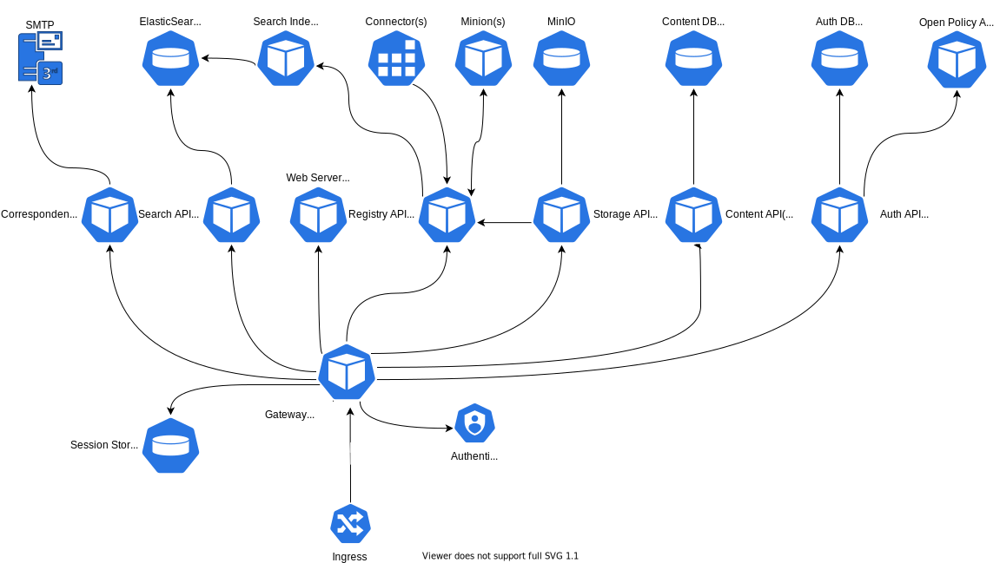
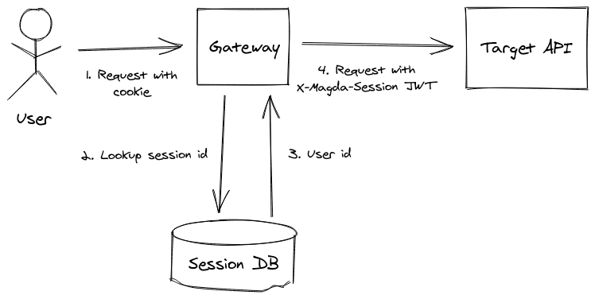
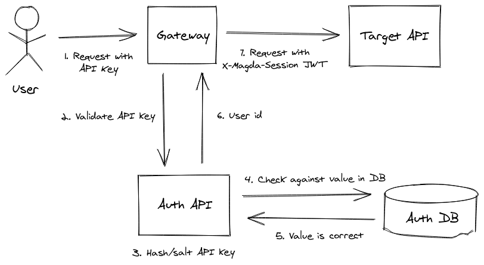
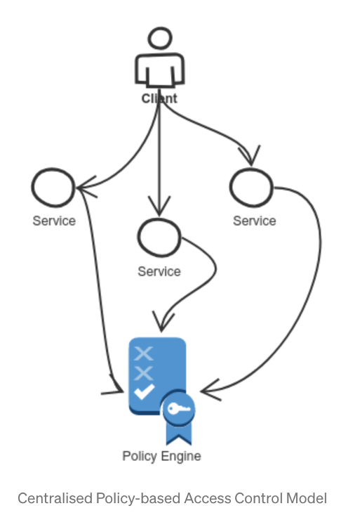
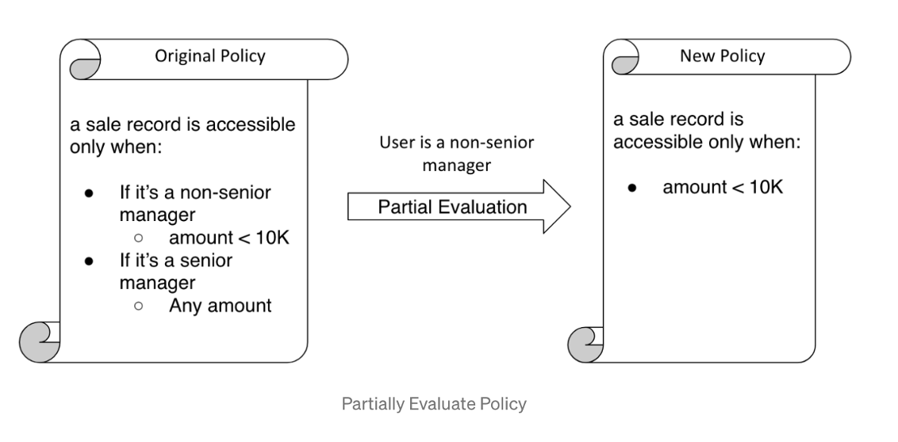
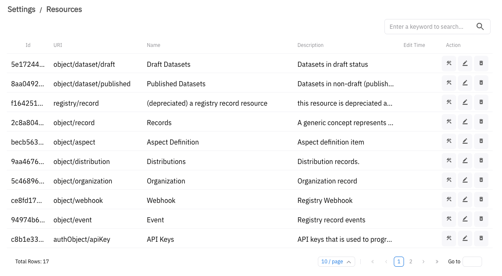
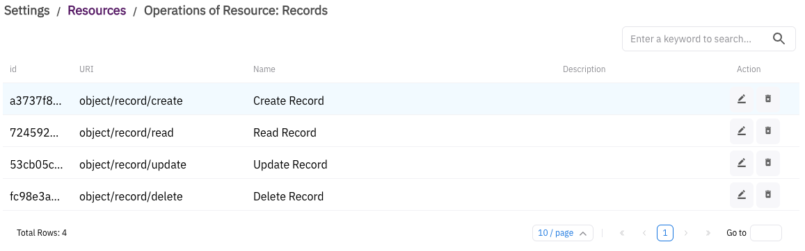
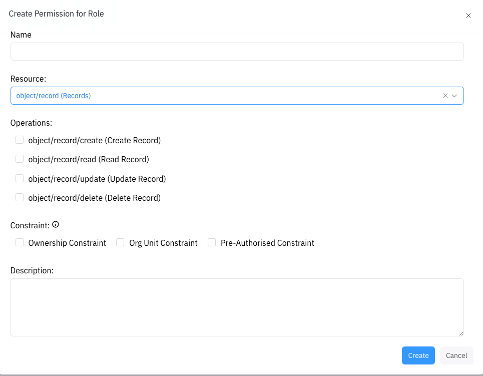

# Table of Contents

- [Architecture Diagram](#architecture-diagram)
- [Components](#components)
  - [Authorization API](#authorization-api)
  - [Connectors](#connectors)
  - [Content API](#content-api)
  - [Correspondence API](#correspondence-api)
  - [Gateway](#gateway)
  - [Minions](#minions)
  - [Registry](#registry)
    - [Records](#records)
    - [Aspects](#aspects)
    - [Events](#events)
    - [Webhooks](#webhooks)
  - [Search API](#search-api)
  - [Search Indexer](#search-indexer)
  - [Storage API](#storage-api)
  - [Web Server](#web-server)
- [Authentication (authn)](#authentication-authn)
  - [Internal Requests](#internal-requests)
  - [External Requests](#external-requests)
    - [Authentication Plugins Based Authentication](#authentication-plugins-based-authentication)
      - [Session Management](#session-management)
    - [API Key Based Authentication](#api-key-based-authentication)
- [Authorization (authz)](#authorization-authz)
  - [Legacy System & History](#legacy-system-history)
  - [New Authorisation Model & Implementation](#new-authorisation-model-implementation)
    - [Policy Engine & Partial Evaluation](#policy-engine-partial-evaluation)
    - [Key Concepts of Authorisation Model](#key-concepts-of-authorisation-model)
    - [Resources & Operations](#resources-operations)
    - [Permissions & Roles](#permissions-roles)
    - [Authz Model Rego Policy Structure](#authz-model-rego-policy-structure)
    - [Decision API Endpoint](#decision-api-endpoint)
      - [Types of Decision Queries](#types-of-decision-queries)
    - [Run OPA as a Sidecar Container](#run-opa-as-a-sidecar-container)
- [Structure](#structure)
  - [Core Components](#core-components)
  - [Non-Core Components](#non-core-components)
  - [Serverless Functions](#serverless-functions)
- [Practices](#practices)
  - [Formatting](#formatting)
  - [Testing](#testing)
    - [Property-Based Testing](#property-based-testing)
  - [Review](#review)
- [Build / Continuous Integration](#build---continuous-integration)
  - [Previews](#previews)
- [Release](#release)
  - [Helm](#helm)
  - [Docker](#docker)
  - [NPM](#npm)
- [Deployment](#deployment)
  - [Kubernetes](#kubernetes)
  - [Helm](#helm-1)
  - [Terraform](#terraform)
- [Architectural Decisions](#architectural-decisions)
  - [Macro](#macro)
    - [Why Microservice?](#why-microservices-)
    - [Why Kubernetes?](#why-kubernetes-)
    - [Why Scala (and subsequently why not)?](#why-scala--and-subsequently-why-not--)
    - [Why Node.js?](#why-nodejs-)
    - [Why ElasticSearch?](#why-elasticsearch-)
    - [Why Gitlab CI?](#why-gitlab-ci-)
  - [Front-end](#front-end)
    - [Why a Single Page Application (SPA), and why Create React App?](#why-a-single-page-application--spa---and-why-create-react-app-)
  - [Authn/z](#authn-z)
    - [Why not just store the user id in a JWT and get rid of the session db entirely?](#why-not-just-store-the-user-id-in-a-jwt-and-get-rid-of-the-session-db-entirely-)
    - [Why only pass the user id in the JWT, why not all details about the user?](#why-only-pass-the-user-id-in-the-jwt--why-not-all-details-about-the-user-)

# Architecture Diagram



# Components

As a microservice-based system, Magda consists of a number of individual parts. What follows is a description of the responsibility and capabilities of each, in rough alphabetical order.

> As a cloud-native application, all Magda's components / microservices are packaged as [Helm Charts](https://helm.sh/docs/topics/charts/). You can customise Magda's functionalities via Helm Chart configurations. More info please refer to [Magda's Helm Chart documents](../helm-charts-docs-index.md).

## Authorization API

The Authorization API is responsible for:

- Managing authorisation related objects and providing APIs for accessing those objects.
  - e.g. users, roles, permissions, api keys, resources & operations etc.
- Making any authorisation decisions.

  - In v2.0.0 or later, this is done via [decision API](https://github.com/magda-io/magda/blob/0d6ce1dbc217dd7bf4f0171bf9174f90e81ca4c3/magda-authorization-api/src/createOpaRouter.ts#L220) that is backed by the auth policy engine [Open Policy Agent (OPA)](https://www.openpolicyagent.org/). The API constructs appropriate OPA requests with context data (e.g. user info, role, permissions etc.) based on the JWT tokens (`X-Magda-Session` header) that are carried by incoming requests. It will also further evaluate decision response from OPA and convert it to a concise format (see [API doc](https://github.com/magda-io/magda/blob/0d6ce1dbc217dd7bf4f0171bf9174f90e81ca4c3/magda-authorization-api/src/createOpaRouter.ts#L220) for more details).

> Prior to v2.0.0, this capability is offered via simply proxying raw OPA requests with context data prefilled.

Authorization API is **NOT** responsible for:

- Authentication. Instead, it's taken care of by one of [Authentication Plugins](../authentication-plugin-how-to-use.md) or Gateway's built-in [API keys authentication](../how-to-create-api-key.md) mechanism.
- Session Management. Instead, it's mainly managed by Gateway.

See [Authorization](#authorization-authz) for more details about how Magda's authn system works.

## Connectors

Connectors are responsible for bringing in data from other sources on a one-time or regular basis. Connectors go out to external data sources and copy their metadata into the Registry, so that they can be searched and have other aspects attached to them. A connector is simply a docker image that is invoked as a job. It scans the target data source (usually an open-data portal), then completes and shuts down. We have connectors for a number of existing open data formats, otherwise you can easily write and run your own.

Magda actually runs all connectors as external plugins. Besides a list of existing connectors that you can choose from, you can also choose to create your own connector to integrate with your own system. More details, please refer to [How to build your own connectors doc](../how-to-build-your-own-connectors-minions.md).

## Content API

The Content API is responsible for everything to do with _content_ - that is, what a user sees and interacts with (as opposed to an admin, or another service within the system). Ideally this would mean that all text seen by a user was managed by the Content API, but in practice only a small amount is, the rest is (sadly) baked into the UI at this point.

The Content API is like a very very light headless CMS, used by Magda to hold text and files around content - e.g. the text for certain pages, and certain configurable images like logos. Content can be retrieved by ID, or by querying - e.g. the Magda UI makes a query for anything that affects the header or the footer when it does its initial render, and uses the result to determine what should be in those components.

The Content API was created a long time before the Storage API, and hence stores files in its database by base64ing them and putting them in a table - there's possibly an opportunity to use the Storage API for this instead.

## Correspondence API

The Correspondence API is responsible for sending messages to people (_not_ sending them to machines). In practice this currently just means sending emails based on requests from the UI, but in the future it could potentially also take into account other messaging mediums like SMS or push notifications, and other classes of message like notifications about something changing in the system.

Currently the Correspondence API is used to send questions about datasets to the contact point listed against the contact point if possible, and send direct questions to the Magda admin email address. In order to route a question to the dataset contact point, it grabs the contact point information from the `dcat-dataset-strings` aspect in the registry and if it can find something that looks like an email address in there, it'll use that as the recipient - otherwise it falls back to the default Magda email address.

Email templates are stored in the Content API. The Correspondence API gets the information it needs, passes that information into a template, then uses a configured SMTP server to send out emails. Usually we end up using Mailgun, but it should be possible to route through any SMTP server. Note that the standard SMTP port is usually blocked by cloud providers, however.

## Gateway

The Gateway is responsible for:

- Proxying requests from outside Magda to the correct service
- Session Management
- Managing [Authentication Plugins](../authentication-plugin-how-to-use.md) and coordinating the authentication process
- Managing security related HTTP headers via [Helmet](https://www.npmjs.com/package/helmet)

See [Authentication](#authentication-authn) for more details around how it handles authn.

## Minions

A minion is a service that listens for new records or changes to existing records, performs some kind of operation and then writes the result back to the registry. For instance, we have a broken link minion that listens for changes to distributions, retrieves the URLs described, records whether they were able to be accessed successfully and then writes that back to the registry in its own aspect. Minions don't currently really have a responsibility within the system - their responsibility depends on what they're designed to do, which varies.

Other aspects exist that are written to by many minions - for instance, we have a "quality" aspect that contains a number of different quality ratings from different sources, which are averaged out and used by search.

Magda actually runs all minions as external plugins. Besides a list of existing minions that you can choose from, you can also choose to create your own minions to create your own event driven workflow. More details, please refer to [How to build your own minion doc](../how-to-build-your-own-connectors-minions.md).

## Registry

The core of the Magda is a metadata store (the "Registry") built on top of the [event-sourcing model](https://martinfowler.com/eaaDev/EventSourcing.html).

i.e. any [CRUD operations](https://en.wikipedia.org/wiki/Create,_read,_update_and_delete) to the metadata (via registry APIs) will trigger events which form an event stream that allows you to navigate back to any state of the system at a point in time.

Any other services can choose to subscribe to event stream (for certain type of data), enhance the metadata or performance other actions and send back event processed confirmation to registry via APIs.

> You can find more info on registry API on API doc here:
> https://dev.magda.io/api/v0/apidocs/index.html#api-Registry_Aspects

### Records

Everything in the registry, regardless of what it is, is represented as a “record” in the registry - think of it as a similar concept to a row in a database table, or an object in Object-Oriented Programming.

e.g. Datasets are records, distributions are records, organisations are records, etc.

A “record” by itself can’t carry any data rather than basic info like: `id` and `name`. However, you can attach one or more “aspects”, which is a pieces json data that describes the record further.

All records are treated equally by the registry. Conceptually, we can tell the type of records by the aspects attached to it.

e.g. we can say a “record” with “order-details” aspect is a "order" record.

### Aspects

Before you can attach an aspect (i.e. a pieces json data) to a record, you need to declare the aspect first.

You can declare an aspect by sending a HTTP POST request to [Registry's Aspect API](https://dev.magda.io/api/v0/apidocs/index.html#api-Registry_Aspects-PostV0RegistryAspects) with the following information:

- an id
- a name
- a JSON schema of JSON data you can attach to a record associated with this aspect id.

> Magda's built-in aspects' schema can be found from here: https://github.com/magda-io/magda/tree/master/magda-registry-aspects
> Since v2.0.0 or later, built-in aspects will be auto installed during the initial deployment.

As you are able to declare aspects dynamically via registry APIs, if you have a requirement to store extra information about a dataset or distribution record, you can easily do so by declaring your own aspect - because the system isn't opinionated about what a record is beyond it being a set of aspects.

### Events

An event is generated any time something changes in the Registry - generally when a record, aspect or record-aspect is:

- Created
- Deleted
- Modified

Events that record a modification generally record a [JSON patch](http://jsonpatch.com/) that details what changed inside that entity.

e.g.:

```json
[
  { "op": "replace", "path": "/baz", "value": "boo" },
  { "op": "add", "path": "/hello", "value": ["world"] },
  { "op": "remove", "path": "/foo" }
]
```

Events can be used to track the history of an entity over time, or to reconstruct that entity at a certain time and see what it used to be.

### Webhooks

Webhooks allow services outside the registry (and potentially outside the Magda instance itself in v2.0.0 or later) to be notified of events occurring within the registry, as they occur. A webhook is registered by sending a HTTP `POST` request to the registry APIs webhooks endpoint and specifying:

- what event type(s) are to be listened for
- what aspects are to be listened for
- and a URL where notifications will be sent.

After the webhook is created, the registry will send notifications in HTTP POST requests whenever an event that the webhook's interested in is generated.

For instance, the search indexer keeps the ElasticSearch index up to date by subscribing to nearly every event type that has to do with the `dcat-dataset-strings`, `dataset-distributions` and a few other aspects. When any dataset record is added, deleted or modified in the registry, a webhook is sent to the indexer with details of the change and an up-to-date version of the record, which the indexer either ingests or deletes depending on the event type.

> You can also find out more from API doc: https://dev.magda.io/api/v0/apidocs/index.html#api-Registry_Webhooks-PostHttpSomeRemoteHostWebhookNotificationRecipientEndpoint

## Search API

The responsibility of the Search API is to provide as powerful of a search function as possible, primarily for datasets and a few other objects (publishers, regions).

It's implemented as a wrapper around the search engine [ElasticSearch](https://www.elastic.co/), and allows for searching of datasets, publishers and regions information that is indexed into ElasticSearch by the `Search Indexer` module.

> Note that unlike the Registry, we didn't implement the similar generic "record" / "aspect" based model in ElasticSearch. Instead, the data model is specifically designed to search datasets and "dataset oriented".

> That's also the reason we introduced a more generic authorisation model in v2.0.0 - allows a single authorisation policy to cover the same data in different storage targets: Registry & ElasticSearch regardless the data model differences.

## Search Indexer

The responsibility of the Indexer is to:

- Set up the ElasticSearch index definitions
- Put relevant information (datasets, publishers etc) into the ElasticSearch index, so that the [Search API](#search-api) can serve users' search queries.
- Make other changes to the ElasticSearch index that enables search - e.g. putting regions in so that they can be used for spatial search.

The Search Indexer is always trying to make sure that the datasets stored in the search index matches what's in the Registry's database - this means both responding to Webhook events and doing an initial load of all the datasets in the registry both the first time Magda is run, and whenever the index definition is changed.

On first startup, the Indexer will also try to set up the regions index - at the moment this only knows how to pull in GeoJSON files of ABS regions from the Terria AWS account's S3 and (slowly) load them in. Currently if this is interrupted it won't be retried unless the entire regions index is deleted :(.

The index definitions used by the Indexer change over time - within the code itself there are index definitions, and these have an integer describing their version. When the indexer starts up, it'll check for the existence of an index with its current version - if it can't find one, it'll create it and start populating it. Because the version used by the Search API is specified elsewhere, this means that you can have the indexer working on setting up `datasets41`, for instance, while the Search API is still querying against version `datasets40`.

> You can config the index versions that search API uses via [search API Helm Chart config](../../../deploy/helm/internal-charts/search-api/README.md).

## Storage API

The Storage API is responsible for storing and retrieving files, and applying authorization to those operations.

It's backed by [MinIO](https://min.io/), which in turn can either manage object storage with in-cluster storage or act as a gateway to cloud storage solutions like S3 or Google Storage.

Currently it has a rudimentary authorization mechanism that allows files to be linked to the id of a record in the Registry - only if the requesting user is allowed to see that record are they allowed to download the file. This allows file downloads to be protected in a way that matches record authorization in the Registry.

## Web Server

The web server responsible for serving the files (HTML/JS/CSS) needed to render the front-end, and for passing configuration to the web application. Note that the server logic is specified in the `magda-web-server` directory, but the client-side logic is in `magda-web-client`, which is incorporated into the web server docker image at build time.

# Authentication (authn)

## Internal Requests

Behind Magda's Gateway module, any internal components / microservices identify users by the JWT token that is carried in the `X-Magda-Session` header of the incoming HTTP request. The JWT token contains at least `userId` as a claim (but could potentially contain more information), which allows an internal service find out which user the incoming request is send on behalf of.

If a request doesn't carried a valid JWT token in the `X-Magda-Session` header, it will be considered as sent from "Anonymous" users (you can control "Anonymous" users's access by editing the built-in "Anonymous" role).

A JWT token is usually issued by Gateway when forward external requests from a authenticated user to internal services.

Internal services might also mint JWT tokens in order to access other microservices on behalf of certain account (usually a default system admin user account).

## External Requests

Magda offers two authentication options. They are:

- Authentication Plugins Based Authentication
- API Key Based Authentication

Authentication plugins based authentication allow you to implement any authentication protocol to integrate with any identity providers. On the other hand, API key based authentication is a more light-weight authentication option that doesn't create / maintain sessions.

### Authentication Plugins Based Authentication

Magda's [Authentication Plugin framework](../authentication-plugin-spec.md) is the key infrastructure of Magda's generic & unopinionated authentication solution. An authentication plugin, technically, is made up of a set of HTTP services that are integrated with Magda gateway and (optionally) the frontend UI in order to implement a specific authentication protocol (e.g OAuth 2.0 protocol) supported by an identity provider. In a nutshell, an authentication plugin is responsible for:

- providing interface / API for gateway to query its basic info. e.g.:
  - name & id
  - the authentication workflow it supports
  - optional UI info e.g. icons, whether requires login UI etc.
- HTTP interface / APIs for handling authentication workflow required by the authentication protocol it implements.
- Create cookie based session for successful authenticated users
- Optional HTTP interface / APIs for handling remote session (of the identify provider) logout process.

To implement your own auth plugin, please refer to [Authentication Plugin Specification](../authentication-plugin-spec.md) for more details.

Users can also choose to use [a list of generic authentication plugins](https://github.com/magda-io?q=magda-auth-) offered by Magda project. e.g., If you don't want to reply on any external identity providers, you can use [magda-auth-internal](https://github.com/magda-io/magda-auth-internal) auth plugin, which allow you to authenticate users with locally store user credential.

#### Session Management

Unlike "API Key Based Authentication" option, Authentication Plugins Based Authentication option is designed for the use case involves multiple HTTP requests with user interactions. Because of it, a cookie based session (managed using [express-session](https://www.npmjs.com/package/express-session)) is created when the user is authenticated through the authentication plugin.

When subsequent requests from the users arrive at Magda's gateway module, the gateway will retrieve the ID of authenticated user from the session DB with the session ID that is contained in the HTTP request cookie. It will then forward the request to the appropriate internal API with an `X-Magda-Session` JWT token header attached (see _Internal Requests_ above) containing that user id.

In this way, the external authentication process is transparent to internal services.



### API Key Based Authentication

Magda also supports API key based authentication. It's designed for the single request use case - more likely initiated by a program rather than an actual user. Because of it, it's designed to be light-weight with no session being created after the authentication. Once a request is authenticated, the request will be forwarded with an `X-Magda-Session` JWT token header to internal services straightaway. API key based authentication is handled by Gateway module without any auth plugin involved.

API Keys are created up-front - one user can have zero-to-many API Keys associated with it. An API Key consists of an ID, and the key itself. To create an API key, please refer to the [How to Create API Key Document](../how-to-create-api-key.md). Once the API key is created, you can attach `X-Magda-API-Key` and `X-Magda-API-Key-Id` headers to your request in order to get authenticated.



# Authorization (authz)

## Legacy System & History

Magda started with a very simple authorization system that only that has boiled down to a boolean column `isAdmin` on the `users` table: either a user is an admin, or is not an admin, as specified by a value in the users table of the Auth DB. If the user is an admin they can do essentially anything in the system, if the user is _not_ an admin they don't have the ability to make any changes at all. Magda has been able to get away with having such a simple mechanism in place for quite a while, because for its original data.gov.au use-case nearly every user had the access to view anything, but nearly all changes were done automatically without user intervention.

Since [v0.0.55](https://github.com/magda-io/magda/releases/tag/v0.0.55), we started to introduce role based access control system powered by policy engine [Open Policy Agent (OPA)](https://www.openpolicyagent.org/). In this release, we introduced:

- The central authorisation policy engine OPA for authorisation decision making
  - We didn't add any new APIs but use our authorisation API service to proxy any decision making request to OPA with context data (e.g. user's profile, role, permission etc) auto-prefilled.
- We introduced our first generic role based access control model implemented with OPA's [rego policy language](https://www.openpolicyagent.org/docs/latest/policy-language/)
  - We will also briefly cover this model in the next section.
  - You can also refer to [this doc](./magda_access_control_sample_story.pdf) for more details.
- Implemented the first version OPA JSON-based Abstract Syntax Tree (AST) parser in both typescript & scala code base
- Implemented the partial evaluation based policy enforcement on search API (Elasticsearch backed storage) & content API (postgreSQL database)
  - We will briefly cover the partial evaluation topic in the next section.
  - You can also refer to [this](https://jacky-jiang.medium.com/policy-based-data-filtering-solution-using-partial-evaluation-c8736bd089e0) & [this article](https://blog.openpolicyagent.org/write-policy-in-opa-enforce-policy-in-sql-d9d24db93bf4) for more info.

Problems with our initial authz implementation are:

- The OPA AST parser is yet to cover all rego's all language features.
- The parser attempted to further evaluate OPA's authz decision in AST in order to eliminate cross-referenced unconditional result. But it didn't work for every cases.
- At policy layer, our opa rego policy implementation was not generic enough to cover the data model differences between the Registry (backed by database) and search engine (use Elasticsearch as storage).
- Didn't implement policy enforcement on Registry APIs.
- There is no way for users to supply their own policies files during deployment.

To address some of the issues above, we released [v0.0.57](https://github.com/magda-io/magda/releases/tag/v0.0.57). In this release, we make it possible to supply external policy files during the deployment (see [PR 2924](https://github.com/magda-io/magda/pull/2924)).

We also implemented policy enforcement on read operation related Registry APIs. The implementation introduced a `authnReadPolicyId` column to registry `records` table to indicate the policy file to be used to make authz decision on any `read` operations for this records. As the implementation is not fully separated from decision making process (e.g. we need to know the policy id for a record before a decision can be made), the solution does work but make it harder for us to add support to other operations and also defeat the purpose of adopting OPA's partial evaluation feature, which is more useful for make decision on a set of resources.

In order to solve all issues in previous implementations and fully realise OPA's potential as a central policy engine, we decide to implement a more generic authz model in our [v2.0.0 release](https://github.com/magda-io/magda/releases/tag/v2.0.0).

In the next section, we will briefly introduce the new generic authz model that powers our v2.0.0 release.

## New Authorisation Model & Implementation

### Policy Engine & Partial Evaluation

The core of our authorisation system is a centralised policy engine: [Open Policy Agent (OPA)](https://www.openpolicyagent.org/). The centralised policy engine model brings us the following benefits:



- Separation of authz decision and policy enforcement
- Single source of truth
- Adapt the changes easily

Besides the benefit above, the policy engine OPA particularly helps us with the followings:

- Powerful (yet simple) [Rego Policy Language](https://www.openpolicyagent.org/docs/latest/policy-language/) for describing a generic authz model
- Partial Evaluation. i.e. The ability of evaluating the authz policy with some of the attributes marked as "unknown" and respond "residual" rules as JSON-based Abstract Syntax Tree (AST).

The "Partial Evaluation" feature is critical to our implementation. Because when filtering records based on a user's authorisation in a large database, we don't want to make decisions on each individual record. Instead, we want to make a single decision on a set of records and convert the decision (more likely a list of rules rather than an unconditional "yes" or "no") into storage specific query DSL (Domain Specific Language) - e.g. SQL (for database) or Elasticsearch Query DSL.

The partial evaluation process is similar to solving an equation. i.e. with an equation contains one or more variables, try to simplify the equation with all known values until you can find a "root" for the equation (i.e. an unconditional authz decision can be made). Otherwise, the simplified version equation will contains the conditions / rules that authorised resources should all meet.



> For more info of Partial Evaluation, you can also have a look at [this](https://jacky-jiang.medium.com/policy-based-data-filtering-solution-using-partial-evaluation-c8736bd089e0) & [this article](https://blog.openpolicyagent.org/write-policy-in-opa-enforce-policy-in-sql-d9d24db93bf4).

### Key Concepts of Authorisation Model

In order to describe a more generic authorisation model, we defined a few key concepts. They are:

- Resources
- Operations
- Permissions
- Roles

> The authz model is re-created from [the original authz story](./magda_access_control_sample_story.pdf) that we proposed for v0.0.55 release. The authz model is similar to the story but didn't implement all features.

> The policy files that implement the authz model can be found [here](https://github.com/magda-io/magda/tree/next/magda-opa/policies).

#### Resources & Operations

The `Resource` is the concept represents any access control targets. It can be a record, a dataset, an API or an even UI component. If you are thinking about securing anything in the system, you can create a resource via "Auth API".

<p>

<div style="text-align: center; font-size: small"> List of Pre-defined Resources  </div>
</p>

Depends on the nature of the resource, a resource:

- Could have user ownership
- Could belong to an organisational unit
- Could be configured with pre-authorised access. i.e. an association between a `Permission` (see next section) and the `Resource`.

Those three properties decide which kind of scope constraint that we can apply to a permission. The actual implementation of the three properties can be different depends on the data model of the `Resource` & storage option. For Registry records, it is implemented as [access-control Aspect](https://github.com/magda-io/magda/blob/next/magda-registry-aspects/access-control.schema.json). A sample of `access-control` Aspect data can look like the following:

```json
{
  "ownerId": "cd09249f-53ed-43b4-b7d4-39cf501293e7", // user id of the owner
  "orgUnitOwnerId": "2d05fbe1-6d9a-4dfc-b64d-8924f880a393", // id of the root node of an org unit sub tree
  "preAuthorisedPermissionIds": [
    // a list of permission IDs that are authorised
    "ad9269e2-ac42-43a4-91c7-bd2cfa6c0c6e",
    "6d0a4130-4de1-4e13-a01b-da947ca13ab9"
  ]
}
```

A resources can also have one or more supported `Operations`. i.e. any possible actions could be taken on the resource. e.g. "create”, "read", "assign" or "acknowledge".

<p>

<div style="text-align: center; font-size: small"> List of Operations for "record" Resources  </div>
</p>

One thing we should keep in mind is that: from policy engine's point of view, either `Resource` or `Operations` are just attributes during the the policy evaluation. It's up to the actual policy enforcement implementation (i.e. the actual code implement the access control) to interpret the actual meaning of the `Resource` or `Operations`. This principle helps us to decouple our model from the enforcement implementation and remain as a generic model.

Internally, the system uses an UUID to identify a `Resource` or `Operations`. However, it's not a convenient naming choice when we query the policy engine. Therefore, when create a `Resource` or `Operations`, we can nominate an URI for purpose of calling it later. An URI is made of one or more segments that are separated by `/`.

For a `Resource`, we often choose 2 segments URI. e.g. `object/record`. The first segment `object` indicates the resource is a data object (i.e. the resource's type) and second segment `record` is a short name of the resource. For a `Operations`, its URI is made up of the associated `Resource` URI plus the `Operations`'s short name. e.g. `object/record/create`.

When an Authz decision is sought, e.g. we need to know which records the current user can read, we only need to send the operation URI `object/record/read` to [the auth decision API](https://github.com/magda-io/magda/blob/e10a202de7cc0c3610b206ca9daaaabddb00e79f/magda-authorization-api/src/createOpaRouter.ts#L220).

> The system screenshots in this section are from a setting area only available since v2.0.0. The setting area offers functions that allows users to manage all authz related objects. If you want to have a play, please upgrade to [v2.0.0 release](https://github.com/magda-io/magda/releases/tag/v2.0.0) or newer.

#### Permissions & Roles

A `Permission` can be simply considered as an access `key` allows a user to perform specified operations on a type of resource. A `Permission` is made up of a list of operations that the permission grant a user to perform and possible constraint settings.

<p>

<div style="text-align: center; font-size: small"> Create Permission Form  </div>
</p>

Depends on the constraint setting, system supports 4 different type of permissions:

- Permission with no Constraint.
  - i.e. the permission allow a user to perform the listed operation with no any restriction.
- Permission with Ownership Constraint
  - Grant access to resource owner only.
  - Useful for implicit Access Control.
  - e.g. user can modify his own datasets.
- Permission with Organisational Unit Constraint
  - Grant access to users who belong to the organisational unit sub tree.
  - Useful for implicit Access Control.
  - E.g. The user can access all records within his division.
- Permission with Pre-authorized Constraint
  - Grant access to resource objects that are pre-configured to accept this “key” (permission).
  - Useful for fine-grained access controls cross organisational units & regardless its ownership.

A `Role` can be simply considered as a container of `Permissions`. We can't assign `Permission` directly to a user. Instead, we need to assign a `Role` to a user. The access of a user depends on all `Permissions` that are associated with the user via all user's `Roles`.

Besides user created `Roles`, there are 3 special built-in roles:

- `Admin Users`: user with this role has access to any resources and can perform any operations with no restriction.
  - This role is commonly used by Magda's internal services to access resources / other APIs.
- `Anonymous Users`: Before a user is authenticated, all his requests will be considered from a default user with `Anonymous Users` role.
  - You can edit the permissions that this role contains in order to control the "public access" of your application.
- `Authenticated Users`: All users by default will be assigned this role.

### Authz Model Rego Policy Structure

The authorisation model is described in [OPA's rego policy language](https://www.openpolicyagent.org/docs/latest/policy-language/). Policy files can be found [here](https://github.com/magda-io/magda/tree/next/magda-opa/policies).

Among all policies files, [entrypoint/allow.rego](https://github.com/magda-io/magda/blob/next/magda-opa/policies/entrypoint/allow.rego) is the "entrypoint" policy. We should query against this "entrypoint" policy for all decisions sought for any resources. This "entrypoint" policy will then delegate the decision making to the appropriate policy for a particular resources. This structure enables a consistent decision making interface regardless the inclusive relationship between different types resources and avoids redundant authorisation rules to ensure single source of truth principle.

e.g. When query the "entrypoint" policy with operation URI "object/dataset/read", the entrypoint will delegate the decision making to [object/dataset/allow.rego](https://github.com/magda-io/magda/blob/next/magda-opa/policies/object/dataset/allow.rego) and output rules specific for dataset records.

However, when query the "entrypoint" policy with operation URI "object/record/read" (i.e. generic record resource), the entrypoint will delegate the decision to all defined subset resources policies (e.g. "dataset", "distribution", "organization" etc.). Together with authorisation rules for generic record resource, the query result will be similar to the following pseudo code:

```
- when the record looks like a dataset record, the following rules apply.
- when the record looks like a distribution record, the following rules apply.
- when the record looks like a organization record, the following rules apply.
....
- otherwise, the common rules for generic record apply for any other type of records.
```

In the [Registry section](#registry) & [Search API section](#search-api), we mentioned that the data models in Registry & search engine ElasticSearch index are different. Thanks to the policy structure design, we will be able to query the same authorisation models from a different view. i.e. we are able to query operation URIs "object/record/_" for Registry's "generic record" oriented APIs and query operation URIs "object/dataset/_" for Search API's "dataset" oriented APIs.

### Decision API Endpoint

Since v2.0.0, we introduced a decision API as a new additional to the Auth API service. All decision requests should be sent to this API instead of querying OPA directly. Compared with querying OPA APIs directly, this API offers the following benefits:

- integrated with "entrypoint" policy file
- auto-create policy evaluation context data with user's profile including user's roles, permissions & user's current organisational unit.
- auto-select OPA API endpoints (either for partial evaluation or making unconditional decision) based on information provided.
- further evaluate the OPA decision response AST and resolve any possible cross references

#### Types of Decision Queries

Depends on whether you want a decision for a single resource object (e.g. the user attempts to update a record) or a set of resource objects (e.g. retrieve all records that the user is allowed to read), you can request the decision API in different ways.

- When a decision for a single resource object is sought, you are required to supply all attributes of the target object (in case a "create" operation, you should provide the data used to create the object) as part of "input" context data in your request. As the "input" context data object is shared for all policies, to avoid interference, you need to put your object data at the JSON path same as the "resource URI". e.g. For a query against operation `object/record/update`, the "resource URI" is `object/record`. Thus, the record object data should be put at `input.object.record`. Here is an example:

```json
{
    "operationUri": "object/record/update",
    "input": {
        "object": {
            "record": {
                "id": "sssss",
                "name": "xxxxx",
                "dcat-dataset-strings": {
                    ....
                },
                "source": {
                    ....
                }
                ...
            }
        }
    }
}
```

The response will be similar to:

```json
{
  "hasResidualRules": false,
  "unknowns": [],
  "result": true // -- the evaluation value of the policy. By default, `true` means operation should be `allowed`.
}
```

- When you need a decision for a set of resource object, you don't need to supply any object data. The decision endpoint will auto mark context data JSON path `input.object.record` as `unknown` and ask OPA to partially evaluate the policies.

The request sent to decision API can be simply like:

```json
{
  "operationUri": "object/record/record"
}
```

The detailed document of the decision API can be found from [here](https://github.com/magda-io/magda/blob/e10a202de7cc0c3610b206ca9daaaabddb00e79f/magda-authorization-api/src/createOpaRouter.ts#L220)

> The HTML version doc can be accessed via the footer link of a deployed Magda site. You can also build Magda's API doc manually to avoid the deployment. Just go to `magda-apidocs-server` module and run `yarn build`. The HTML version API docs will be available from `build` folder.

> We implemented decision API integration code as [Directives](https://github.com/magda-io/magda/blob/next/magda-scala-common/src/main/scala/au/csiro/data61/magda/directives/AuthDirectives.scala) in scala code base and [middlewares](https://github.com/magda-io/magda/blob/e10a202de7cc0c3610b206ca9daaaabddb00e79f/magda-typescript-common/src/authorization-api/authMiddleware.ts#L83) in nodejs codebase. You can choose to reuse those code or write your own.

### Run OPA as a Sidecar Container

Prior to v2.0.0, we used to run OPA as a separate microservice, although proxy all requests from our Auth API service. For better performance & making policy engine highly available to our Auth API service, we now run OPA as a sidecar container of [Auth API service pod](https://github.com/magda-io/magda/blob/e10a202de7cc0c3610b206ca9daaaabddb00e79f/deploy/helm/internal-charts/authorization-api/templates/deployment.yaml#L70).

The OPA container also runs with our own docker image that carries built-in policy files while we still allow users to supply their own policy files to overwrite built-in policy files via [authorization-api helm chart's opa.customPolicyConfigMaps config option](https://github.com/magda-io/magda/tree/next/deploy/helm/internal-charts/authorization-api).

# Structure

## Core Components

Currently, Magda has core components, which are needed by most Magda deployments, and non-core components, which are components that serve specific purposes and are unlikely to be needed in all installations.

The core components are managed in a single monorepo at https://github.com/magda-io/magda. In order to manage the components that are in the monorepo, we use [Lerna](https://github.com/lerna/lerna) and [Yarn Workspaces](https://classic.yarnpkg.com/en/docs/workspaces/). This allows us to run a command like `lerna run build`, which will do the equivalent of running `yarn run build` in every component that has a `build` command in `scripts`.

Most of the core repo's components are written in Typescript, but there are a few Scala-based ones too. Each of these Scala services are built by [SBT](https://www.scala-sbt.org/), and there's a parent SBT project to link them all together in the root directory. Scala-based components also have `package.json` files in them that attempt to glue `lerna` and SBT together - e.g. the Scala components' package.json files usually define a `build` script that runs `sbt build` when invoked.

The core repo also contains a `scripts` directory, containing a number of javascript-based scripts that perform various utility tasks for Magda, including:

- Building docker images
- Generating API documentation
- Running typescript-based node.js services through nodemon
- Creating user passwords
- Creating API keys

## Non-Core Components

In addition to the core of Magda, there are a number of components that are either maintained as separate repositories in the github.com/magda-io organisation, or by completely different developers. These include all minions and connectors maintained by the core Magda team.

In general, the idea is that these are built into separate docker images and helm charts, and seperately deployed into the same Kubernetes namespace as Magda, so that they can interact with the core Magda components.

## Serverless Functions

Recently Magda has introduced serverless functions through [OpenFAAS](https://www.openfaas.com/). These are generally generated from [this template](https://github.com/magda-io/magda-function-template). They're deployed very simililarly to normal non-core components in that you ship a Docker image and a Helm chart, with a few differences:

- Rather than deploy a stand-alone docker image, you deploy an image that's based on [OpenFAAS' of-watchdog image](https://github.com/openfaas/of-watchdog).
- Rather than the helm chart being based around a Kubernetes Deployment or some other kind of core Kubernetes object, it will deploy a `Function` object from the `openfaas.com/v1` namespace.
- Rather than being directly managed by Kubernetes, the function will be managed by an existing installation of OpenFAAS.

In general, it's advantageous to use a serverless function when the workload is likely to be inconsistent - i.e. if a service will have no load a lot of the time, but a lot of load at other times. This is because OpenFAAS functions are capable of scaling to zero - that is, they can be unloaded when not in use, taking up no resources, and then re-loaded and scaled up when they're called later on.

# Practices

## Formatting

Javascript/Typescript code is formatted via [prettier](https://prettier.io/) - this should happen automatically upon commit. In `magda-web-client`, if code is submitted that hasn't been formatted with prettier, the build will fail.

Similarly, all Scala should be formatted via [scalafmt](https://scalameta.org/scalafmt/). There's no automatic step to do this currently (it takes a lot longer than prettier), but there is an `sbt` task to do it for you, as well as a bunch of editor plugins. If Scala code is committed that hasn't been formatted, it'll fail the build.

## Testing

In general all functionality in Magda should have a test - however, unfortunately not all of it does. If you add _new_ functionality to a back-end component, even if it didn't have tests before, you should try to add them.

Currently there's no testing of the front-end at all, so it's not expected that these will be added for new functionality (at least not yet).

In general, Magda favours testing end-to-end inside its microservices, rather than doing pure unit testing. In practice this means that the REST API is tested directly using something like [supertest](https://github.com/visionmedia/supertest) or [akka http testkit](https://doc.akka.io/docs/akka-http/current/routing-dsl/testkit.html), and only calls out to other services or databases are mocked (and in some cases even those aren't mocked!). This is so we can test the _interface_ of each service, which changes slowly, instead of the _implementation_, which could be totally changed without changing the interface.

### Property-Based Testing

In some places, particularly the Search API and Indexer, Magda makes use of [Property Testing](https://en.wikipedia.org/wiki/Property_testing). This is a style of testing often used in functional programming - rather than create a bunch of tests with manually-created test inputs, you define the range of values that a certain _property_ should hold true for, and the test framework repeatedly runs your test with a range of values.

In general we've been transitioning away from property testing because it takes quite a while and makes onboarding difficult. However, they're still present in a number of tests within the codebase, so will probably need to be retained for a while.

## Review

# Build / Continuous Integration

Instructions on building Magda locally can be found [here](https://magda.io/docs/building-and-running.html).

Magda is also built in a CI pipeline on Gitlab CI. You can see recent builds [here](https://gitlab.com/magda-data/magda/pipelines).

The CI pipeline consists of a large number of individual jobs, so that:

- Jobs can be run in parallel for quicker builds
- More intensive jobs (particularly anything involving Scala!) can be split off and run on a specific, powerful test runner

Gitlab CI does its builds based on Docker images, so in general the build process looks like:

1. Build the docker images to do the build on, using the last valid images built for `master`
2. Pull in dependencies
3. Compile and test
4. Build docker images
5. (manual) Preview
6. (sometimes) Release

## Previews

One of the cooler things that Magda's CI setup does is allow for complete previews to be deployed into their own namespace on the dev cluster from a branch. If you're logged into Gitlab with the right permissions, and the build is finished, then you can click the "Play" button on one of the preview jobs. There are a few options:

- Full Preview: This creates a new namespace with a full Magda deployment, then pulls in the most up to date database backup from the dev server. This used to be useful, but as the dev database has grown it's got to the point where it takes days to deploy. Hopefully eventually we'll develop a way to reduce the number of events in the database, and this will become viable again.
- Full Preview (no data): This creates a new namespace with a full Magda deployment, but sets up the data from scratch rather than pulling in a backup. This is much much quicker (~15 minutes usually), but means that you've got to do the work to create your own test data. Subsequent deployments will _not_ erase the data, so feel free to click it again if you push another commit
- UI Only Preview: This deploys only the Magda web server, which will use the Magda dev server for an API to back it. Use this if you've made a change that only affects the UI and doesn't change anything in the backend.
- Stop Preview: Make sure you click this once the branch has been merged, it pulls down whatever preview has been created to free up resources.

# Release

As an application that consists of a number of microservices, databases etc, Magda can't be distributed just as code. As such, there are three main channels of distribution:

- A Helm chart, which contains Kubernetes configuration that explains: - What docker images to download - How they should communicate - How they should scale - What resources they should take - How to start them up - etc.
- Docker images, which contain the actual code and runtime for the services
- NPM packages, which distribute common libraries that can be used by third-party code

A release process is documented [here](https://github.com/magda-io/magda/wiki/Release-Process).

## Helm

Magda's Kubernetes configuration is fairly complex - it's distributed as a number of Helm charts:

- `magda-core`, which contains the core Magda services (see [components](#components))
- `magda`, which depends on `magda-core` and also includes non-core components like minions and connectors
- Various charts for connectors, minions, functions etc that are maintained by the Magda team

The charts maintained by the Magda team are automatically pushed to an S3 bucket by the build process, and that S3 bucket is accessible publically at https://charts.magda.io. Maintaining the structure of files etc in that bucket is automatically done by the `helm` tool that runs as part fo the build job. Helm releases run whenever a tag is pushed with the pattern `v*.*.*`.

## Docker

Distributing the actual code and runtimes is done via Docker images. These are pushed to the `data61` organisation on [DockerHub](https://hub.docker.com/) whenever a tag is pushed with the pattern `v*.*.*`.

## NPM

In order to make it easier for code to be reused across both the core Magda monorepo and external repositories (within the Magda team and also outside it), we publish a handful of repositories on NPM. The publishing of these is manually triggered via the Gitlab CI UI.

# Deployment

A deployment process is documented [here](https://github.com/magda-io/magda/wiki/Deploy-Process).

## Kubernetes

Magda is a complex and distributed system - in order to make it practical to install, we need something that'll capture how all the microservices should start, talk to each other, scale etc, and in order to make this happen we use Kubernetes.

Kubernetes allows us to write down the logical system as text (inside YAML or JSON files), and we can then use that to spin up identical systems, ideally with just one command. Kubernetes allows us to specify what docker images should run, how many instances of each there should be, how they should use storage, how they should scale up/down, how they should handle failure etc.

## Helm

Magda is an open-source system intended to be usable for a range of different use-cases, and as such Kubernetes on its own isn't quite enough - we need a way to be able to pass parameters into Kubernetes so that it can come up with different system configurations based on our needs. This is part of what Helm does for us - it's essentially a templating system that allows us to generate different YAML files to pass into Kubernetes based on parameters passed in to logic in the templates. While it can simply be used to turn templates into Kubernetes config, it can also handle the installation/upgrade process, keeping track of history and handling rollbacks where needed.

The other role that Helm plays for Magda is in distribution. Helm aspires to be a package manager for the Kubernetes ecosystem, like what NPM is to Node. As such, it allows for packages (which it calls "Charts") to depend on other packages, which can be depended on themselves and so on. This is very helpful for a system like Magda because our intention is that the core Magda functionality should sit in the middle of an ecosystem of optional components that can be swapped in or out. With Helm, we can instruct users to create their own helm configuration which includes Magda as well as their own choice of connectors, minions etc. Ideally, the entire configuration for all of this should be able to fit into a quite small text file, which the Helm tool can pick up and turn into a functional Kubernetes installation.

In practice Helm is a tool that's still quite early in its life and still has a lot of warts, but it is improving quickly.

## Terraform

While Kubernetes and Helm can handle a lot of what makes Magda work, there are still things that sit outside its scope - for instance, once we've got a working Kubernetes cluster then we can start deploying with Helm, but how do we actually provision that cluster? What if we're running on Google Cloud and need to provision a Google ingress with Google's CDN for instance, or a Google Cloud SQL database?

This gap is optionally handled by Terraform - it can be used to provision the actual, vendor-specific cloud infrastructure that's needed in order to run Kubernetes so that we can start using tools like Helm. Potentially everything that Terraform currently does for us can also be done via tools like the GCloud command line or web control panel, but using a tool like Terraform allows us to easily write down and reproduce these configurations.

# Architectural Decisions

## Macro

### Why Microservices?

Generally microservices are used in order to make it easier for different teams to work on the same product, and to allow different technologies/languages to work together in the same system.

Neither of these _really_ apply to Magda - in general there's one team that works on (at least the core of) the system, and while there are multiple programming languages, ideally we'd only use one.

The answer is that while there's only one core team that works on Magda, the idea is that microservices work in the greater Magda ecosystem the same way that microservices at Twitter might work for the various teams at work there.

The idea is that microservices provide language-agnostic extension points for Magda: while there are a core set of services written by the Magda team, an individual Magda installation might be a mix of core Magda microservices, third-party open-source services and bespoke services created for that installation. You can see the framework for this in concepts like connectors and minions - while there are first-party ones created by the Magda team, there is opportunity for anyone who runs a Magda instance to add their own too.

This is intended to improve upon conventional extension/plugin systems like you might see in CKAN or Wordpress. By making the extension point a REST service, any language that can run inside docker and make HTTP calls can be used to build extensions, meaning that there's no need to learn our language or even really read our code.

You can read a bit more about the idea [here](https://medium.com/magda-io/open-source-is-missing-out-on-microservices-kubernetes-is-the-solution-996e68710ff2).

### Why Kubernetes?

Essentially the decision to use Kubernetes follows on from being an open-source system based on microservices - if we're going to have a bunch of services and also expect people to be able to just stumble across the Github and set them all up, we need some mechanism that'll make that happen without them having to spend days doing plumbing in cloud provider interfaces.

There are of course alternatives. We actually started with Docker Compose, but while this is fine for local development with a few services, the complexity of the system quickly outgrew it, plus in general it's easier to manage the devops around deploying Kubernetes just because it's much more often used as a production-grade solution.

Potentially we could've used something like AWS CloudFormation too, but that would couple the solution to AWS - we wanted to retain at least a reasonable level of vendor agnosticism, and in particular the ability to be able to run on-premises if needed.

There are other more direct Kubernetes competitors like Docker Swarm, CloudFoundry, Mesosphere. We didn't take too much of a look at those because we already had some people adjacent to the team with experience in running Kubernetes, so there was much more of a brains trust available there.

### Why Scala (and subsequently why not)?

At the time we started the project, Scala seemed like a reasonable choice - plenty of people in Data61 knew it, it supported production workloads just fine for a bunch of organisations, and its unique blend of functional and object-oriented programming concepts suited the direction of Data61 Engineering and Design, which at the time did a lot of functional programming, even if our team directly didn't know much about it.

Magda also started as a monolith, and in that context Scala and other JVM-based languages make a lot more sense, because you can just run one big well-resourced JVM and have confidence that it'll scale pretty well. This fell apart a bit when we started splitting out into microservices, because we found that you can only make a JVM-based application so small, resource-wise, until it just stops really functioning at all. This is the main reason we switched mainly to using Node.js - it's much better able to scale _down_ and run services that handle very little traffic but also reserve very few resources.

The other big problem with Scala is that it compiles _slowly_. This is something that's barely noticable at first, but as you write more and more code in it, compilation times get slower and slower, and by the time it's not bearable any more, you've already got a non-trivial effort on your hands to migrate away from it. This is also a big problem in CI - compiling and running Scala is the most resource-intensive job we have.

### Why Node.js?

[It's bad ass rock star tech](https://www.youtube.com/watch?v=bzkRVzciAZg).

Seriously though, the main reasons are:

- It's resource requirements when it's idle or has little traffic are quite modest, which suits Magda because for most installations the services don't actually do much a lot of the time
- Everyone on the team already knew Javascript
- It has a very vibrant ecosystem of libraries (maybe too vibrant!)
- Typescript allows us to have a lot of the strong-typing advantages that Scala had, with a fraction of the compilation overhead

Something like Go has similar advantages in terms of being able to run without a lot of resources and compile quickly, but we didn't have any Go experience on the team, and Typescript offers a much more powerful type system (although this can be good or bad depending on who you ask).

### Why ElasticSearch?

Magda was originally concieved pretty much purely as a search engine, and hence we reached for the most powerful search technology we could find. While you can get quite far with text search in Postgres, even on day 1 we had more advanced requirements like this, because having an advanced search was intended to be Magda's selling point and a key point of advantage over the old, CKAN-based data.gov.au search.

In particular, ElasticSearch offers:

- Very powerful text search, even with no tuning at all: using tfldf etc
- Word stemming (being able to match plurals with non-plurals, present tense with past tense etc)
- Spatial/temporal search (possibly Postgres could do this too)
- Synonyms
- The ability to horizontally scale (we don't actually make use of this very much, but we could)

### Why Gitlab CI?

The main reason we continue to use Github CI is because it for open source projects, it offers _a lot_ for free. In particular:

- We can split the build into loads of concurrent jobs to make everything go faster
- We can use their runners for smaller jobs, and they're quite generous with this
- It integrates with Github PRs
- They have their own free docker registry, which makes building one image per branch really easy
- We can pretty easily provide our own runners on our own physical hardware
- We can start or stop preview deployments really easily from the Gitlab UI
- The new directed acyclic graph feature makes the build a lot quicker.

The main factor is definitely the amount we get for free as an open source project. We've considered Github's new competing feature, but it has some pretty constricting limits on it.

## Front-end

### Why a Single Page Application (SPA), and why Create React App?

Magda's UI was built as a React SPA mainly because that's what the developers were already familiar with building from work on TerriaJS. Most of the site is static information and doesn't really need to be dynamic Javascript, but there are instances where it works pretty well - in particular some of the more advanced input methods we've built into the Add Dataset flow.

A key limitation of this approach is that currently there's no server-side rendering at all. While Google is still able to index the site because there's a server-rendered sitemap, this is probably limiting the SEO of Magda-based websites.

## Authn/z

### Why not just store the user id in a JWT and get rid of the session db entirely?

That would work too, but this way we can invalidate sessions whenever we want - see [this blog post](https://developer.okta.com/blog/2017/08/17/why-jwts-suck-as-session-tokens).

### Why only pass the user id in the JWT, why not all details about the user?

This was done because:

- It's simpler, which made it quicker to implement in the first place, and because it's simple it's less error-prone, which is always nice where security is concerned
- We never got to the point where just passing the id and having the recipient service look up the user was a performance problem

If performance problems did come up, it would certainly be possible to include more details about the user in the JWT, although attention would have to be paid to ensuring that this could be extended by third-party implementers of Magda.

### How to debug Authorisation Decision made by the policy engine?

You can set [authorization-api helm chart](https://github.com/magda-io/magda/tree/next/deploy/helm/internal-charts/authorization-api)'s `debug` config value to `true` to put `authorization-api` into "debug mode".

Under "debug mode", `authorization-api` will print any authorisation decision details (including context data) to the logs.
