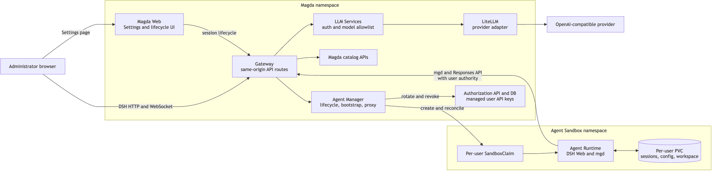

# Agent Workspace architecture and deployment

## Status and scope

Agent Workspace is an opt-in Magda capability that gives each authorized user a
private, browser-based coding and data-analysis agent. The MVP embeds DeepSeek
Harness (DSH) Web under **Settings → Agent Workspace**, bundles the `mgd` CLI,
and connects the agent to Magda using the current user's authority.

The feature is disabled by default with `global.agentWorkspace.enabled=false`.
The MVP additionally restricts access to members of Magda's **Admin Users** role.
It supports one current workspace per user.

## Architecture



The browser uses same-origin Settings, lifecycle, DSH HTTP/WebSocket, and LLM
routes. Agent execution is isolated in a per-user Sandbox and PVC; model-provider
credentials remain in the Magda namespace.

### Components

- **Magda Web** exposes the feature-flagged, admin-only Settings route and renders
  lifecycle state. When ready, it embeds the runtime through
  `/api/v0/agent/runtime/`. The managed embedding permanently crops DSH's own
  left navigation so the conversation uses the available width.
- **Agent Manager** is stateless. It authenticates the Gateway session, checks
  current role membership through `whoami`, manages Kubernetes resources,
  bootstraps the runtime, proxies DSH HTTP/WebSocket traffic, and reconciles idle
  workspaces.
- **Kubernetes Agent Sandbox** provides the per-user execution boundary. The
  qualified API version is Kubernetes Agent Sandbox v1.0.4. Both ordinary `runc`
  and optional gVisor templates are supplied through warm pools.
- **Agent Runtime** pins DSH, bundles `mgd`, and applies a deployment-owned Cordis
  profile. The workspace is mounted at `/data/workspace`; runtime configuration
  and DSH state are stored on the same per-user PVC.
- **LLM Services** independently authenticates the Magda user and allowlists
  deployment-selected model IDs before proxying to LiteLLM. Provider errors are
  sanitized at this boundary.
- **LiteLLM** holds the provider configuration. Provider credentials enter only
  through a Kubernetes Secret and are never sent to the browser or Sandbox.
- **Authorization API and DB migration** provide expiring system-managed API
  keys. These keys are private, hidden from public key lists, and immutable
  through public key-management routes.

## Lifecycle and resource identity

A user UUID maps deterministically to the claim name
`magda-agent-<user UUID>` and label `agent.magda.io/user-id=<UUID>`.
The user-visible states are:

`ABSENT`, `ALLOCATING`, `BOOTSTRAPPING`, `READY`, `SUSPENDING`, `SUSPENDED`,
`RESUMING`, `DELETING`, `FAILED`, and `DEGRADED`.

Provisioning performs these operations:

1. Rotate the reserved `magda-agent-workspace` managed API key. Its expiry is no
   later than the hard workspace lifetime.
2. Create/adopt the user's `SandboxClaim` from the selected warm pool.
3. Wait for the claim and Sandbox Pod to become ready.
4. Send a one-time bootstrap payload through `pods/exec` over stdin.
5. Write `mgd` configuration and DSH environment to mode-0600 files on the PVC.
6. Restart the runtime container and require post-bootstrap readiness before
   returning `READY`.

Idle `READY` workspaces with no active runtime WebSockets are suspended. Resume
reuses the PVC and Sandbox. Reset, explicit deletion, and logout revoke the key,
close sockets, delete the claim and storage, and remove all DSH sessions and
workspace files. Logout waits for cleanup before destroying the Magda session.

## Authentication and trust boundaries

- Browser cookies and Gateway session headers terminate at Agent Manager. They
  are stripped before proxying to DSH.
- Agent Manager exchanges the memory-only DSH launch token for a DSH cookie and
  never returns either credential to the browser.
- The runtime receives a lifecycle-bound Magda key as raw `<key-id>:<key>`.
  DSH's OpenAI adapter adds the HTTP authorization scheme. Adding `Bearer` to
  the stored value is incorrect because DSH expects a raw API key.
- `mgd` uses the same lifecycle-bound user key against the configured external
  Magda `/api` base URL, so normal Magda authorization remains authoritative.
- Agent Manager RBAC includes `pods/exec` for bootstrap and deliberately excludes
  `pods/log` to avoid exposing the one-time payload.
- Gateway logout cleanup uses both a system JWT and a separate randomly generated
  control-plane secret. Destructive cleanup is same-origin gated.
- The Sandbox NetworkPolicy allows DNS, the selected ingress controller, and
  explicitly configured external CIDRs/ports. Private address ranges otherwise
  remain denied.

## Managed DSH profile decisions

The deployment, not the user, owns provider, model, plugin, permission, and
reasoning configuration. The managed profile therefore:

- defaults to `workspace-write` with approval policy `ask`;
- exposes only the deployment-selected model and reasoning levels;
- hides provider/model/plugin configuration pages;
- removes the Model, Permission, and Feedback commands from the composer menu;
- disables persistent `danger-full-access` selection;
- permanently hides DSH's left navigation in the Magda iframe; and
- keeps workspace documents rooted at `/data/workspace`.

The underlying permission service remains mounted even though its selector is
hidden. This preserves enforcement while removing the interactive selector from
the managed UI. DSH registers `/permission` from that same core service, so the
runtime includes a small client-only managed-profile plugin that filters the
command from composer candidates without weakening host-side enforcement.

For reasoning models with tools, the DSH route uses the OpenAI Responses API.
For example, GPT-5.6 Sol with `reasoningEffort: high` cannot use function tools
through Chat Completions, but it does support them through `/v1/responses`.
LLM Services proxies both Responses and Chat Completions for compatibility.

## Key implementation decisions

### Stateless manager, Kubernetes-owned state

The manager can restart without an application database. Claims, Sandbox status,
annotations, PVCs, and the Authorization DB are the durable sources of truth.
Per-user in-flight operations are serialized; destructive operations queue
behind provisioning rather than being silently dropped.

### Warm pools

Warm Sandboxes reduce first-use latency. The claim's reported Sandbox name is
always used rather than predicting a Pod name. A replacement unclaimed Sandbox
is created automatically after adoption.

### External Magda route from the Sandbox

`mgd` and LLM calls intentionally use the external Gateway rather than bypassing
it with service-to-service URLs. This exercises ordinary authentication,
authorization, routing, and audit boundaries. Local self-signed deployments must
map the external hostname to the ingress Service IP and mount its CA certificate.

### Memory-only token handoff

The DSH launch token is written to a memory-backed `emptyDir`, read by Agent
Manager with `pods/exec`, and exchanged server-side. It is not stored on the PVC
or exposed through Pod logs.

### Same-origin runtime proxy

Serving DSH below the Magda origin avoids third-party-cookie and iframe-origin
problems. The proxy supports WebSockets, pins the upstream Host, caps request
bodies, authenticates before buffering, deduplicates cookie exchange, and closes
open sockets during destructive lifecycle operations.

## Helm configuration

Enable the four feature charts and Gateway/Web integration:

```yaml
global:
  agentWorkspace:
    enabled: true
    sandboxNamespace: magda-agent

agent-manager:
  warmPool: magda-agent-runc
  hardDeleteSeconds: 28800
  idleSuspendSeconds: 1800
  llm:
    provider: magda
    model: gpt-5.6-sol
    reasoningEffort: high

agent-runtime:
  warmPool:
    runcReplicas: 1
    gvisorReplicas: 0
  storage:
    size: 1Gi

llm-services:
  allowedModels: gpt-5.6-sol

litellm:
  model:
    alias: gpt-5.6-sol
    providerModel: openai/gpt-5.6-sol
    reasoningEffort: high
```

Use a model available to your provider account. Leaving `reasoningEffort` empty
omits the parameter. Production deployments should use immutable image tags and
an externally managed Secret rather than local `latest` images.

## Deployment

### Prerequisites

1. A Kubernetes cluster with an ingress controller and a working Magda release.
2. Kubernetes Agent Sandbox v1.0.4 installed cluster-wide:

   ```sh
   kubectl apply --server-side -f \
     https://github.com/kubernetes-sigs/agent-sandbox/releases/download/v1.0.4/sandbox-with-extensions.yaml
   kubectl -n agent-sandbox-system rollout status deploy --timeout=300s
   ```

3. A Magda authentication plugin or another way to establish an administrator
   session. `magda-auth-internal` is not a dependency of `magda-core`.
4. Images for Agent Manager, Agent Runtime, LLM Services, Authorization API,
   Gateway, Web Server, and Authorization DB Migrator published to a registry
   accessible by the cluster.
5. A provider API key stored outside Helm values:

   ```sh
   kubectl -n <magda-namespace> create secret generic litellm-provider \
     --from-literal=api-key="$OPENAI_API_KEY" \
     --dry-run=client -o yaml | kubectl apply -f -
   ```

### Build local images

From the repository root, the following commands build the new services. Use
organisation-specific image names/tags for a shared registry:

```sh
(
  cd magda-agent-manager
  ../node_modules/.bin/create-docker-context-for-node-component \
    --build --tag localhost:5000/magda-agent-manager:latest --local
)
(
  cd magda-llm-services
  ../node_modules/.bin/create-docker-context-for-node-component \
    --build --tag localhost:5000/magda-llm-services:latest --local
)
docker build -f magda-agent-runtime/Dockerfile \
  -t localhost:5000/magda-agent-runtime:latest .
```

Build the changed existing components using the repository's standard component
builder, including `magda-authorization-api`, `magda-gateway`,
`magda-web-server`, and `magda-migrator-authorization-db`.

### Minikube-specific setup

The supplied `deploy/helm/magda-core/agent-workspace-minikube-values.yaml`
expects local images loaded into Minikube. For each local image:

```sh
minikube -p <profile> image load localhost:5000/<image>:latest
```

Create the Sandbox namespace and trust the local ingress certificate:

```sh
kubectl create namespace magda-agent --dry-run=client -o yaml | kubectl apply -f -
INGRESS_IP=$(kubectl -n ingress-nginx get svc ingress-nginx-controller \
  -o jsonpath='{.spec.clusterIP}')
kubectl -n ingress-nginx get secret magda-test-tls \
  -o jsonpath='{.data.tls\.crt}' | base64 --decode >/tmp/magda-agent-ca.crt
kubectl -n magda-agent create secret generic magda-agent-trusted-ca \
  --from-file=ca.crt=/tmp/magda-agent-ca.crt \
  --dry-run=client -o yaml | kubectl apply -f -
```

Generate the cluster-specific ingress override. Do not commit the ephemeral
Service IP:

```sh
cat >/tmp/agent-workspace-ingress-values.yaml <<EOF
agent-runtime:
  hostAliases:
    - ip: ${INGRESS_IP}
      hostnames: [magda.test]
  externalPrivateCidrs: [${INGRESS_IP}/32]
  externalPrivatePorts: [443]
EOF
```

Refresh chart dependencies and deploy:

```sh
helm dependency update deploy/helm/magda-core
helm upgrade --install magda deploy/helm/magda-core \
  --namespace magda --create-namespace \
  -f deploy/helm/magda-core/agent-workspace-minikube-values.yaml \
  -f /tmp/agent-workspace-ingress-values.yaml \
  --set global.agentWorkspace.enabled=true \
  --timeout 15m --wait
```

If deploying through the top-level `deploy/helm/magda` umbrella, run
`helm dependency update deploy/helm/magda` first so its generated local
`magda-core` dependency is current.

For a Docker-driver Minikube profile, expose ingress ports when creating the
profile or use a persistent port-forward. Map `magda.test` to `127.0.0.1` on the
browser host when using a local port mapping:

```text
127.0.0.1 magda.test
```

### Production deployment

Use the same values through the normal Magda umbrella or deployment repository,
with these differences:

- publish versioned images and configure the standard global image registry and
  pull secrets;
- use a real external hostname and trusted TLS certificate;
- omit local `hostAliases` when cluster DNS resolves the external name, while
  retaining the required NetworkPolicy destination;
- provision `litellm-provider` through the platform secret manager;
- choose `runc` or an installed isolation RuntimeClass and size warm pools/PVCs;
- set hard lifetime and idle suspension values for the organisation's policy;
- include the Authorization DB migration before starting the updated
  Authorization API; and
- retain `global.agentWorkspace.enabled=false` until all dependencies and secrets
  are ready.

### Verification

After deployment:

```sh
kubectl -n magda rollout status deploy/agent-manager
kubectl -n magda rollout status deploy/llm-services
kubectl -n magda rollout status deploy/litellm
kubectl -n magda-agent get sandboxclaims,sandboxes,pods
```

Log in as an administrator, open **Settings → Agent Workspace**, start the
workspace, and wait for `READY`. Verify:

1. the DSH navigation is absent and the composer does not offer Feedback,
   Permission, or Model commands;
2. a simple prompt returns a model response;
3. a tool-using prompt succeeds through `/api/v0/llm/v1/responses`;
4. `mgd auth status` identifies the logged-in Magda user;
5. a Registry read succeeds; and
6. reset/logout removes the claim and managed API key.

The full lifecycle and security qualification procedure is in
`docs/docs/e2e-test-cases/agent-workspace.md`.

## Operational notes

- A same-tag local runtime image does not replace existing warm Sandboxes. Delete
  only the unclaimed warm Sandbox and wait for its replacement before resetting a
  test workspace onto a rebuilt image.
- LiteLLM configuration changes require a Pod restart unless the deployment
  template checksum changes.
- A `runAsNonRoot` image must declare a numeric UID. Agent Manager and LLM
  Services use UID 1000; Agent Runtime uses UID/GID 10001.
- Local GPT-5.6 Sol use required a 1 GiB LiteLLM memory limit during qualification.
- Reset and logout are destructive by design. Publish important outputs to Magda
  or another durable store first.
