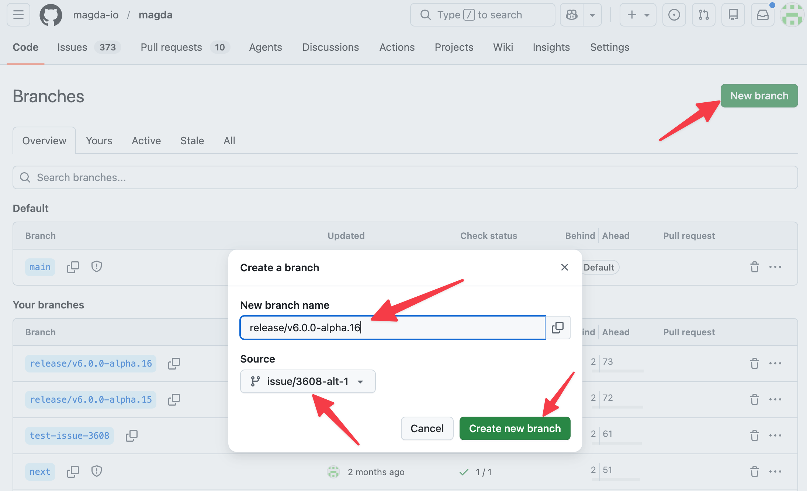
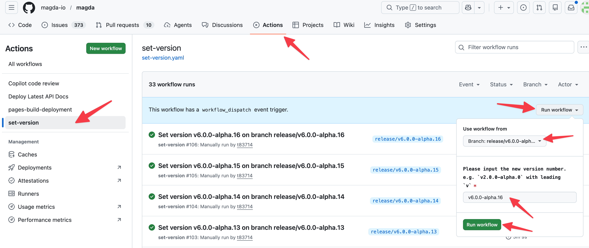
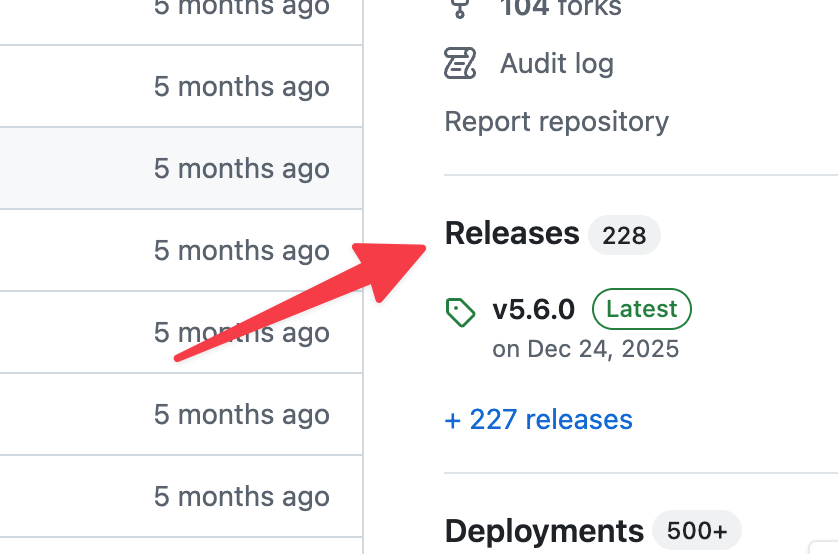
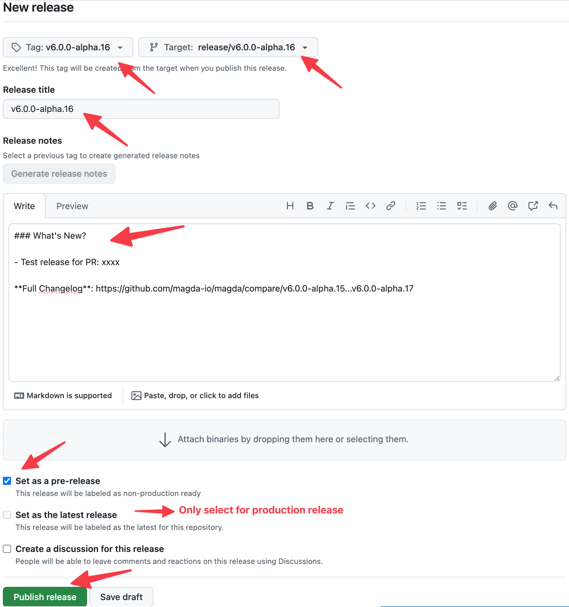
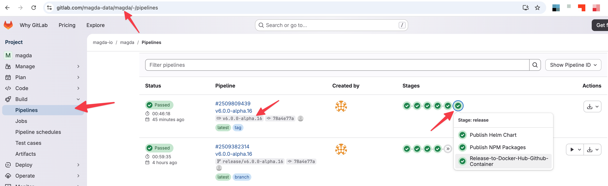

# How to Release a New Version

This guide covers how to release a new version of MAGDA. A release publishes Docker images, NPM packages, and Helm charts to their respective registries. The same process applies whether you are creating a PR testing build, an alpha release from the `next` branch, or an official production release — the difference is which branch you create the release branch from and which version string you use.

## Version Format

MAGDA follows [Semantic Versioning](https://semver.org/). A version string is structured as follows:

```
v6.0.0-alpha.0
│ │ │ │
│ │ │ └─ pre-release version: alpha.0
│ │ │    ├─ identifier: alpha
│ │ │    └─ identifier: 0
│ │ └─ patch: 0
│ └─ minor: 0
└─ major: 6
```

### Pre-release Identifiers

The first identifier in the pre-release version indicates the release type:

| Identifier | Meaning                                    | Example           |
| ---------- | ------------------------------------------ | ----------------- |
| `alpha`    | Planned early release (from `next` branch) | `v6.0.0-alpha.0`  |
| `beta`     | Broader testing release                    | `v6.0.0-beta.0`   |
| `rc`       | Release candidate                          | `v6.0.0-rc.0`     |
| `pr`       | Temporary PR/testing build                 | `v6.0.0-pr.248.0` |

## Release Types

Not every release is a production release. The table below summarises the different release types, when to use them, and which branch to release from:

| Release Type          | Version Pattern                                          | Example           | Create Release Branch From |
| --------------------- | -------------------------------------------------------- | ----------------- | -------------------------- |
| PR testing build      | `v<MAJOR>.<MINOR>.<PATCH>-pr.<PR_NUMBER>.<BUILD_NUMBER>` | `v6.0.0-pr.248.0` | PR branch                  |
| Next major alpha      | `v<NEXT_MAJOR>.0.0-alpha.<N>`                            | `v6.0.0-alpha.0`  | `next`                     |
| Beta release          | `v<MAJOR>.<MINOR>.<PATCH>-beta.<N>`                      | `v5.7.0-beta.0`   | `main` or `next`           |
| Release candidate     | `v<MAJOR>.<MINOR>.<PATCH>-rc.<N>`                        | `v5.7.0-rc.0`     | `main` or `next`           |
| Official / production | `v<MAJOR>.<MINOR>.<PATCH>`                               | `v5.7.0`          | `main`                     |

### PR Testing Builds (most common)

The most frequent use of this release process is to let a team member do a final test on their PR **after** the PR has been reviewed and passed all CI test cases, but **before** the PR is merged. The CI pipeline does not cover Helm chart deployment or full end-to-end smoke testing, so this gives the PR author a chance to deploy a fresh instance from their PR build and verify everything works.

For PR testing builds, create a release branch from the PR branch and use the version pattern `v<MAJOR>.<MINOR>.<PATCH>-pr.<PR_NUMBER>.<BUILD_NUMBER>`. For example, for PR #248:

- `v6.0.0-pr.248.0` — first test build
- `v6.0.0-pr.248.1` — second test build (if fixes were needed)
- `v6.0.0-pr.248.2` — third test build

### Alpha Releases (from `next`)

The `next` branch is used for developing the next major release. To create an alpha release, create a release branch from `next` and use the alpha pre-release pattern:

```
v<NEXT_MAJOR_VERSION>-alpha.<BUILD_NUMBER>
```

For example: `v6.0.0-alpha.0`, `v6.0.0-alpha.1`, `v6.0.0-alpha.2`, ...

### Official / Production Releases (from `main`)

Official production releases should **only** be released from the `main` branch. These use a clean semver version without any pre-release suffix (e.g., `v5.7.0`). Before starting a production release, ensure:

- All changes intended for the release have been merged into `main`
- All CI pipeline checks are passing on `main`
- The `CHANGES.md` file has been updated with the changes included in this release

## Release Process

Regardless of release type, the process is always the same four steps: create a release branch, set the version, create a GitHub Release, and monitor the pipeline. The only differences are which branch you create the release branch from and which version string you use.

### Step 1: Create a Release Branch

Always create a dedicated release branch before setting the version. The set-version workflow commits version changes directly to the branch, and you don't want those version bump commits going into your source branch (e.g., your PR branch, `next`, or `main`).

Create a branch following the naming convention `release/v<VERSION>` from the appropriate source branch:

| Release Type       | Create from      | Example branch name       |
| ------------------ | ---------------- | ------------------------- |
| PR testing build   | PR branch        | `release/v6.0.0-pr.248.0` |
| Alpha release      | `next`           | `release/v6.0.0-alpha.0`  |
| Beta / RC release  | `main` or `next` | `release/v5.7.0-beta.0`   |
| Production release | `main`           | `release/v5.7.0`          |

You can create the branch via the GitHub UI or the command line:

```bash
git checkout <source-branch>
git pull
git checkout -b release/v6.0.0-pr.248.0
git push -u origin release/v6.0.0-pr.248.0
```



> **Note:** At this point, the GitLab CI pipeline will rerun building pipelines to verify the code on the branch. You can monitor the pipeline while you proceed to the next step.

### Step 2: Set the Version Number

MAGDA uses a **GitHub Actions workflow** to update the version number across all packages, Helm charts, and configuration files in the monorepo.

1. Go to the repository on GitHub
2. Navigate to **Actions** > **set-version** workflow
3. Click **Run workflow**
4. Select the **release branch** you created in Step 1 (e.g., `release/v6.0.0-pr.248.0`, `release/v6.0.0-alpha.0`, or `release/v5.7.0`)
5. Enter the **version string** with leading `v` (e.g., `v6.0.0-pr.248.0`, `v6.0.0-alpha.0`, or `v5.7.0`)
6. Click **Run workflow**



The workflow will:

- Validate the version format (must be valid semver with leading `v`)
- Run `yarn set-version` which uses Lerna to update all `package.json` files
- Update all Helm chart versions in `Chart.yaml` files
- Commit and push the version changes to the release branch

Wait for this workflow to complete before proceeding.

> **What gets updated:** The version is set in `lerna.json`, all workspace `package.json` files, and all Helm `Chart.yaml` files under `deploy/helm/`.

### Step 3: Create a GitHub Release

Once the version has been set and the GitLab CI pipeline for the release branch has finished building, you can create the release.

1. Go to the repository on GitHub
2. Navigate to **Releases** > **Draft a new release**
3. Configure the release:
   - **Choose a tag:** Enter the version string (e.g., `v6.0.0-pr.248.0`) — this will create a new tag
   - **Target:** Select the **release branch** (e.g., `release/v6.0.0-pr.248.0`)
   - **Release title:** Use the version string
   - **Description:** Describe what's in this release. For production releases, you can reference or copy the relevant section from `CHANGES.md`
   - **Set as a pre-release** and **Set as the latest release:** see the table below
4. Click **Publish release**





> **Important:** The tag you create here must exactly match the version set in Step 2. The CI pipeline validates that the tag matches the package version — a mismatch will cause the release to fail.

#### Pre-release and Latest Release Settings

Unless you are releasing an official production version, you should **always** select `Set as a pre-release` and **never** select `Set as the latest release`:

| Version           | Purpose                     | Pre-release? | Latest release? |
| ----------------- | --------------------------- | :----------: | :-------------: |
| `v6.0.0-pr.248.0` | PR testing build            |    ✅ Yes    |      ❌ No      |
| `v6.0.0-alpha.0`  | Alpha release               |    ✅ Yes    |      ❌ No      |
| `v6.0.0-beta.0`   | Beta release                |    ✅ Yes    |      ❌ No      |
| `v6.0.0-rc.0`     | Release candidate           |    ✅ Yes    |      ❌ No      |
| `v6.0.0`          | Official production release |    ❌ No     |     ✅ Yes      |

**Why this matters:** GitHub uses the **latest release** label to indicate the release users should generally consume. The **pre-release** option signals that a release is not ready for production and may be unstable. If `Set as latest release` is not explicitly selected, GitHub automatically assigns the latest release label based on semantic versioning. If a non-production release is marked as latest, users, automation, badges, or scripts that rely on GitHub's "latest release" may accidentally pick up a testing build.

### Step 4: Monitor the Release Pipeline

Creating the tag triggers the GitLab CI release pipeline. The pipeline runs through these stages:

1. **builders** — Build base Docker images
2. **prebuild** — Install dependencies
3. **buildtest** — Run all tests (TypeScript, Scala, integration tests, Helm chart validation)
4. **dockerize** — Build Docker images for all components (multi-arch: `linux/amd64`, `linux/arm64`)
5. **pre-release** — Validate that the tag version matches the package version
6. **release** — Publish all artifacts:
   - **Docker images** → `ghcr.io/magda-io/*` (GitHub Container Registry)
   - **NPM packages** → `@magda/*` on npmjs.org
   - **Helm charts** → `oci://ghcr.io/magda-io/charts` (magda-core, magda, magda-common)

You can monitor the pipeline progress in GitLab CI.



The full pipeline typically takes several minutes to complete.

### Step 5: Verify the Release

After the pipeline completes, verify that all artifacts have been published:

- **Docker images:** Check `ghcr.io/magda-io/` for images tagged with your version
- **NPM packages:** Check [npmjs.com](https://www.npmjs.com/org/magda) for updated `@magda/*` packages
- **Helm charts:** Verify with:
  ```bash
  helm show chart oci://ghcr.io/magda-io/charts/magda --version <VERSION>
  ```
- **GitHub Release:** Confirm the release page on GitHub shows the correct tag and description

## Docker Image Tagging

Depending on the release type, Docker images receive different tags:

| Condition                                                   | Tags Applied          |
| ----------------------------------------------------------- | --------------------- |
| Any version tag (e.g., `v5.7.0`, `v6.0.0-alpha.1`)          | The exact version tag |
| Stable version only (e.g., `v5.7.0`, no pre-release suffix) | `latest`              |
| Push to `main` branch                                       | `main`                |
| Push to `next` branch                                       | `next`                |

## Troubleshooting

### Version mismatch error

If the `pre-release:check-release-version` job fails, it means the Git tag does not match the version in `package.json`. Make sure you ran the **set-version** workflow on the correct branch before creating the release tag.

To fix: delete the tag and release on GitHub, re-run the set-version workflow if needed, then create the release again.

### Pipeline job failures

If any release stage job fails (Docker push, NPM publish, Helm push):

- Check the GitLab CI job logs for the specific error
- Common causes include:
  - **NPM publish:** Attempting to publish a version that already exists (npm does not allow overwriting)
  - **Docker push:** Registry authentication issues
  - **Helm push:** Chart packaging errors
- For transient failures, the Docker and Helm release jobs have automatic retry (1 retry)
- If the issue is fixed, you can create a new release with a corrected version

### Re-releasing a version

NPM does not allow republishing the same version. If you need to re-release with fixes, you must bump to a new version (e.g., `v5.7.1` instead of `v5.7.0`).

## Release Artifacts Summary

| Artifact      | Registry                                | Example                                    |
| ------------- | --------------------------------------- | ------------------------------------------ |
| Docker images | `ghcr.io/magda-io/<component>`          | `ghcr.io/magda-io/magda-search-api:v5.7.0` |
| NPM packages  | `npmjs.org/@magda/<package>`            | `@magda/typescript-common@5.7.0`           |
| Helm charts   | `oci://ghcr.io/magda-io/charts/<chart>` | `oci://ghcr.io/magda-io/charts/magda-core` |
