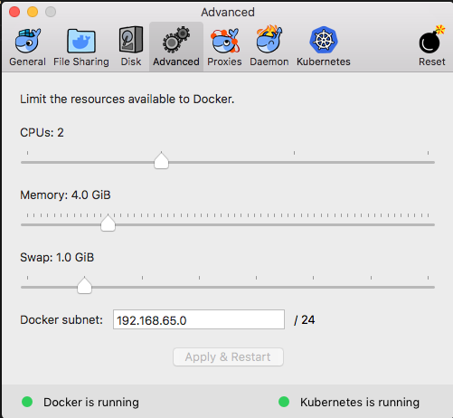
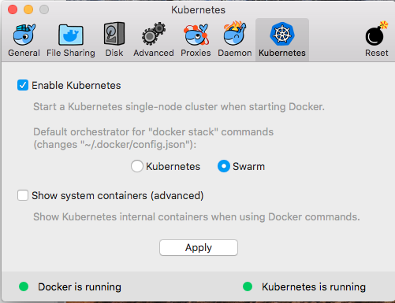

# Installing Docker Kubernetes

In the latest Edge release for MacOS, Docker have included a local kubernetes cluster that works a bit like Minikube - although in our experience it runs a bit better.

Download and install:

-   [Docker for Mac Edge Client](https://docs.docker.com/docker-for-mac/install/#download-docker-for-mac)

Make sure you get the EDGE client - as of the time of writing Kubernetes isn't in the stable client.

## Setup

Start up Docker for Mac. Find the icon in the top-right hand corner of the screen and open "Preferences". Then navigate to "Advanced" and set the resources so your cluster has at least 2 processors and 6gb of RAM.



Then enable Kubernetes



Once it's enabled you can switch your `kubectl` context via the docker menu, or run

```bash
kubectl config use-context docker-for-desktop
```

Last thing to do is create the `standard` storageclass used by Magda:

```bash
kubectl create -f deploy/kubernetes/docker-client-standard-storage.yaml
```
