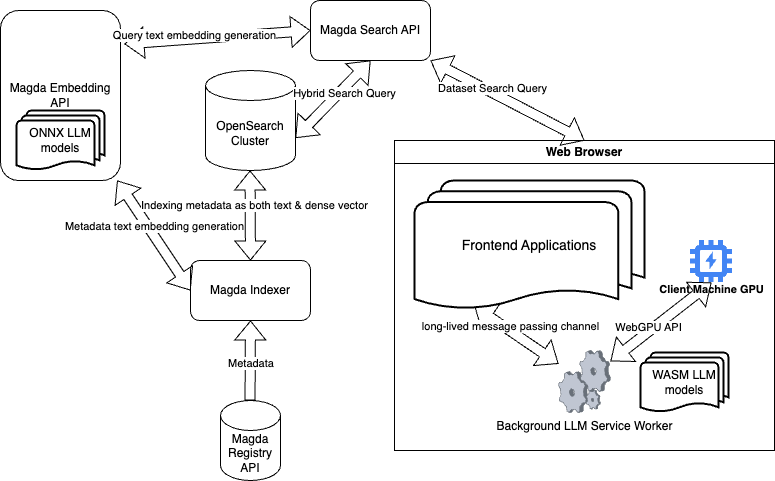

## Overview

As part of the **Magda v5.0.0** release, we are introducing a new chatbot feature that transforms how users interact with datasets. This feature enables users to access and analyze data through a **Large Language Model (LLM)-powered chat interface**, enhancing data discoverability and usability.

## Main Functionality

Depending on the page the user is accessing, the chatbot provides the following capabilities:

- **Dataset Search:** Users can ask the chatbot to find datasets based on specific queries.
- **Tabular Data Analysis:** For tabular data files within a dataset, the chatbot can analyze and generate insights. Users can visualize results as charts and view the SQL query behind the analysis. The query can be further refined using the **SQLConsole** feature in Magda v5.0.0.

[](https://www.youtube.com/watch?v=AvB2YiFU59g)

## Key Features

### 1. **In-Browser LLM Processing**

Unlike traditional server-side LLM solutions, Magda's chatbot operates **entirely within the user's web browser** using the WebGPU API. This in-browser solution eliminates the need to install any desktop applications, making deployment seamless and accessible from anywhere.

#### Key advantages:

- Supports **large-scale users** without incurring high LLM inference costs.
- LLM inference happens on **client devices**, addressing privacy concerns.
- No desktop application installation is required, ensuring a **lightweight and user-friendly experience**.

### 2. **LLM Inference Engine as a Service Worker**

Magda leverages the [web-llm](https://github.com/mlc-ai/web-llm) project to run LLMs directly in a web browser. The LLM inference engine is implemented as a **background service worker**, providing key benefits such as:

- The model file is downloaded **only once** on demand and cached locally.
- The service worker is **event-driven**, activating only when the user interacts with the chatbot and remaining inactive when not in use, thereby conserving system resources.

### 3. **Hybrid Search Engine Support**

The chatbot feature is powered by Magda's new **hybrid search engine**, which combines **lexical search** (keyword-based) and **semantic search** (vector-based).

- **Lexical search** ensures **fast and deterministic retrieval** for structured queries, exact values, and technical terms like model numbers and SKUs.
- **Semantic search** leverages deep learning and vector embeddings to understand the intent behind user queries, delivering **more relevant** results beyond simple keyword matches.
- The **hybrid search** approach enhances chatbot responses, ensuring users receive the most **accurate datasets and analysis results**.

For more details about Magda's hybrid search engine, refer to [this document](./hybrid-search-engine.md).

## Architecture

The diagram below illustrates the architecture of the Magda Chatbot feature:



## System Requirements

To use the chatbot feature, users need:

- **At least 5GB of VRAM.**
- **Google Chrome browser** (other browsers are not supported at this moment).
- The LLM inference engine is packaged as a [Google Chrome extension](https://chromewebstore.google.com/detail/magda-llm-service-worker/ljadmjdilnpmlhopijgimonfackfngmi). Users will be prompted to install the extension when accessing the chatbot.

For more details, visit the [Magda LLM Service Worker Extension repository](https://github.com/magda-io/magda-llm-service-worker-extension).

## Configuration & Deployment

The chatbot feature is **not enabled by default** and can be enabled via the Magda Helm chart configuration by setting:

```
magda.magda-core.web-server.enableChatbot: true
```

### Additional Configuration Options:

- **`llmExtensionId`**: The extension ID for the web-llm service worker Chrome extension. You can specify a different ID when forking and publishing your own extension. More details are available in the [Magda LLM Service Worker Extension repository](https://github.com/magda-io/magda-llm-service-worker-extension).
- **`llmExtensionRequiredVer`**: The required version of the extension (supports [Semantic Versioning](https://semver.org/), e.g., `>=1.0.4`).
- **`llmExtensionInstallationUrl`**: The installation URL for the extension, displayed to users when the extension is not installed or does not meet the version requirement.

For a full list of configuration options, refer to the [Web Server Helm Chart documentation](https://github.com/magda-io/magda/blob/main/deploy/helm/internal-charts/web-server/README.md).
