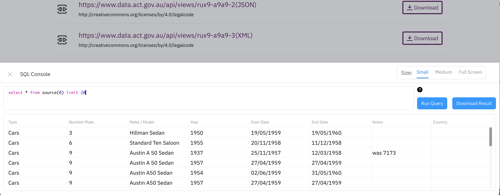

# Magda SQL Console - Quick Guide

## Overview

Magda SQL Console is an in-browser SQL query tool that allows users to query tabular datasets, including Excel spreadsheets, CSV, TSV, and TAB-separated data files, regardless of whether the data is stored and managed by Magda or a third-party platform. The queries are executed on the client side using browser resources, making it a scalable and efficient solution.



- The main input area allows users to enter SQL queries.
- Results are displayed in a tabular format.
- Users can download query results as a CSV file by clicking the **Download** button.
- By default, only the first 1000 records are shown. This limit can be adjusted via Magda’s `web-server` Helm chart configuration (`sqlConsoleMaxDisplayRows`).

> More details can be found from [`web-server` helm chart document](https://github.com/magda-io/magda/blob/main/deploy/helm/internal-charts/web-server/README.md).

## How to Open SQL Console

You can open the SQL Console at any time using the following keyboard shortcut:

- **Mac:** `Command + Shift + S`
- **Windows:** `Ctrl + Shift + S`

Additionally, other Magda features may launch the SQL Console upon user request.

## Querying Data with `source()` Function

To simplify access to various data sources, Magda extends SQL with the `source()` function, which allows you to query datasets without worrying about underlying storage details or file formats.

### Basic Usage

```sql
SELECT * FROM source(0)
```

The `source()` function accepts one of the following as its parameter:

- **Magda Data Distribution ID (String)**

  ```sql
  SELECT * FROM source("dist-dga-xxxxx-xxx-xxx-xxx")
  ```

  - The function resolves the distribution ID to its access URL and selects the appropriate query engine based on the file format.

- **Index Number (Starting from 0)**

  ```sql
  SELECT * FROM source(0)
  ```

  - This refers to the data resources available on the current page. `source(0)` accesses the first available dataset, `source(1)` the second, and so on.
  - If you are on a Magda distribution page with a single dataset, `source(0)` is the default option.

- **String "this" or No Parameter**

  ```sql
  SELECT * FROM source()
  ```

  - Equivalent to `source(0)`, it queries the first available dataset on the page.

### Additional Options

Depends on the file format, you can optionally supply an additional `options` parameter to the `source()` function as the second parameter.

e.g. For CSV files, you can specify additional options:

```sql
SELECT * FROM source(0, {header: false, quote: "'", separator: ","})
```

- **header:** (`true` by default) If set to `false`, the first row is treated as data instead of column names.
- **utf8Bom:** (`true` if headers are included, otherwise `false`) Adds a BOM marker for compatibility with some applications.
- **separator:** (`;` by default) Specifies the delimiter for CSV fields.
- **quote:** (`"` by default) Defines the character used for quoting strings.
- **raw:** (`false` by default) If `true`, all data is returned as raw strings without conversion.

More details on supported options for CSV formate can be found from: https://github.com/AlaSQL/alasql/wiki/Csv

As we use [AlaSQL](https://alasql.org/) as the underlying SQL query engine, you can find the information of other supported options from the following AlaSQL wiki pages:

- [XLS](https://github.com/AlaSQL/alasql/wiki/Xls)
- [XLSX](https://github.com/AlaSQL/alasql/wiki/Xlsx)
- [HTML](https://github.com/AlaSQL/alasql/wiki/Html)
- [JSON](https://github.com/AlaSQL/alasql/wiki/Json)

## Query Execution & Results

- The main input area allows users to enter SQL queries.
- Results are displayed in a tabular format.
- Users can download query results as a CSV file by clicking the **Download** button.
- By default, only the first 1000 records are shown. This limit can be adjusted via Magda’s `web-server` Helm chart configuration (`sqlConsoleMaxDisplayRows`).

## Performance Considerations

Magda SQL Console processes queries in the browser, so performance depends on the user's hardware.

### Default Limits & Configurations

- **Enable/Disable SQL Console:** `enableSQLConsole` (default: `true`)
- **Max File Size for Querying:** `sqlConsoleMaxFileSize` (default: `50MB` or `52428800` bytes)
- **Max display result rows**: `sqlConsoleMaxDisplayRows` (default: 1000). This config only limit no. of rows displayed in the UI. When over this limit, the user will be notified that only limited result is displayed. However, the user can always download the full result as CSV file via `Download` button.

### Performance Benchmark

Tested on a **16GB M1 MacBook Pro** using a **[1M-record Customer Schema sample CSV dataset (174.2MB, 12 columns)](https://github.com/datablist/sample-csv-files):**

- **Simple Query:**

  ```sql
  SELECT * FROM source(0) LIMIT 10
  ```

  - Query time: 2.458s (3 times average exclude file download time)

- **Aggregation Query:**

  ```sql
  SELECT Company, COUNT(*) AS CustomerNum FROM source(0) GROUP BY Company ORDER BY CustomerNum DESC LIMIT 10
  ```

  - Query time: 3.470s (3 times average exclude file download time)

## Supported File Formats

Magda SQL Console supports the following file formats:

- **CSV** ([Docs](https://github.com/AlaSQL/alasql/wiki/Csv))
- **TXT** ([Docs](https://github.com/AlaSQL/alasql/wiki/Txt))
- **TSV/TAB** ([Docs](https://github.com/AlaSQL/alasql/wiki/Tsv))
- **XLS** ([Docs](https://github.com/AlaSQL/alasql/wiki/Xls))
- **XLSX** ([Docs](https://github.com/AlaSQL/alasql/wiki/Xlsx))
- **HTML** ([Docs](https://github.com/AlaSQL/alasql/wiki/Html))
- **JSON** ([Docs](https://github.com/AlaSQL/alasql/wiki/Json))

## Availability

This feature is available starting from [Magda v5.0.0](https://github.com/magda-io/magda/releases/tag/v5.0.0).
